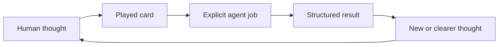

# Think It Through

**Think freely. The agent follows your lead.**

A lightweight command deck for developing complex ideas with AI.

Talk normally. Play a card when you want the agent to clarify, explore, challenge, recover, or preserve the thought.

Each command invokes a self-describing card: a reusable contract for the agent's focus, job, and result.

## Why commands

Ideas can arrive faster than you can package them. Attention jumps between threads, and batches of questions break the flow. For some people with ADHD, stopping to reformat a thought creates friction.

You mix the thought with instructions:

> This could be a method, a set of helpers, or a shared protocol. Separate the ideas, preserve their differences, connect them, then respond.

You state the thought, then direct the agent.

Each card is a reusable conversation helper with one clear job and a useful default. Spend less attention instructing the agent and more attention developing the thought.

Without a card, the agent responds normally.

## See it once

```text
The product might be a method, a set of helpers, and a shared protocol.
Those ideas overlap, but I do not want to collapse them.
/think-distill
```

```text
> 🎯 Latest message → 🧪 DISTILL

Distilled
- Method: the approach a person follows.
- Helpers: operations used during a conversation.
- Protocol: the rules that make those operations coherent.

Connections
A protocol can define helpers without prescribing a method.

Response
Lead with the helpers. Introduce the protocol after the first example.
```

```text
Talk normally
→ play one card
→ repeat or switch cards
→ build a combo when more control becomes useful
```

```text
/think-distill → command
🧪 DISTILL     → card
```

## How it works

You supply ideas and judgment. A card names the agent's next job. Its result feeds your next thought.



The protocol gives every card the same concepts:

- `Context` contains the full relevant conversation and supplied material.
- `Focus` selects what a combo works on without discarding useful context.
- `Conversation → Topics → Axes` supplies navigation when a card needs it.
- `SELECTOR? → JOB* → OUTPUT? → MODIFIER*` is the combo order.

The protocol applies when you use Think It Through or play a card. No initialization is required.

### Optional protocol initialization

Play [`/think-it-through`](plugins/think-it-through/skills/think-it-through/SKILL.md) to initialize the protocol on the available conversation. Alone, it confirms context and focus. With cards, it stays silent.

## Start with six cards

I recommend these six starting points from my conversations. They remain open to revision.

### 🧪 [`/think-distill`](plugins/think-it-through/skills/think-distill/SKILL.md)

Messy thoughts. Latest message. `separate → clarify → connect when supported`

### 💬 [`/think-discuss`](plugins/think-it-through/skills/think-discuss/SKILL.md)

Open exploration. Current thought. `recover → develop → keep open`

### 🔎 [`/think-interview`](plugins/think-it-through/skills/think-interview/SKILL.md)

Missing context. Smallest unclear subject. `research → ask → integrate → repeat`

### 🔥 [`/think-grill`](plugins/think-it-through/skills/think-grill/SKILL.md)

A proposal needs pressure. Current testable idea. `map → recommend → question → repeat`

### 🗺️ [`/think-recap`](plugins/think-it-through/skills/think-recap/SKILL.md)

The conversation has lost its shape. Available conversation. `recover → map → synthesize`

### 🧭 [`/think-propose`](plugins/think-it-through/skills/think-propose/SKILL.md)

An open decision needs direction. Current question. `evaluate → choose → expose tradeoff`

## Keep, resume, or act

```text
latest message         → DISTILL → clear threads
available conversation → RECAP   → navigable map
conversation or result → BRIEF   → portable checkpoint
accepted direction     → PLAN    → execution plan
```

Cards reconstruct this navigation model when they need it:

```text
Conversation
└── Topics
    └── Axes
        ├── ideas and assumptions
        ├── proposals and decisions
        ├── tensions and contradictions
        └── open questions
```

Axes use short labels and can be active, paused, resolved, or replaced. `/think-recap` displays the map. Selectors navigate it without requiring a prior recap. `/think-to-brief` preserves a snapshot; `/think-to-plan` creates operational structure without authorizing execution.

A new session resumes only from a brief or other context you provide. Think It Through does not promise hidden memory or synchronization.

## Install

This README uses portable notation. Provider syntax differs:

| Portable | Codex | Claude Code |
| --- | --- | --- |
| `/think-recap` | `$think-it-through:think-recap` | `/think-it-through:think-recap` |

### Codex

```bash
codex plugin marketplace add thevzion/think-it-through
codex plugin add think-it-through@think-it-through
```

### Claude Code

```bash
claude plugin marketplace add thevzion/think-it-through --scope user
claude plugin install think-it-through@think-it-through --scope user
```

## Build a combo

Type a command to play one card. Combine commands to play a combo.

Each card has a default:

```text
/think-recap

🎯 Available conversation → 🗺️ RECAP
└── applies by default
```

A selector changes the focus for one combo:

```text
/think-on-axis "Artifacts" + /think-recap

🎯 Axis: Artifacts → 🗺️ RECAP
└── selector changed the focus
```

Defaults resolve omitted information without playing hidden cards. `/think-recap` matches `/think-on-conversation + /think-recap`. Standalone `/think-to-brief` does too, unless a job supplies its result.

```text
Intent
“On Positioning, clarify the discussion, propose a direction,
create a brief, and add a diagram.”

Commands
/think-on-topic "Positioning"
+ /think-distill
+ /think-propose
+ /think-to-brief
+ /think-with-diagrams

Resolved trace
🎯 Topic: Positioning → 🧪 DISTILL → 🧭 PROPOSE → 📄 BRIEF + 📊 DIAGRAMS
└── focus              └── job      └── job       └── artifact └── modifier
```

Jobs pass results left to right. A selector chooses the focus, an output creates an artifact, and modifiers represent the same final result. Conflicts require clarification.

For technical readers, a combo acts like a semantic query over a generative engine: the operation is explicit while the content remains generative.

## The deck

The protocol composes 14 cards.

### Job cards

| Card | Play when | Works on by default | Result | Stays in play |
| --- | --- | --- | --- | --- |
| [🧪 `/think-distill`](plugins/think-it-through/skills/think-distill/SKILL.md) | Thoughts arrive tangled | Latest message | Clear thoughts | Once |
| [💬 `/think-discuss`](plugins/think-it-through/skills/think-discuss/SKILL.md) | You want to explore | Current thought | Developed thought | Once |
| [🔎 `/think-interview`](plugins/think-it-through/skills/think-interview/SKILL.md) | Context is missing | Unclear subject | Shared understanding | Multi-turn |
| [🔥 `/think-grill`](plugins/think-it-through/skills/think-grill/SKILL.md) | An idea needs pressure | Testable idea | Verdict or risks | Multi-turn |
| [🗺️ `/think-recap`](plugins/think-it-through/skills/think-recap/SKILL.md) | You lost the shape | Conversation | Map and synthesis | Once |
| [🧭 `/think-propose`](plugins/think-it-through/skills/think-propose/SKILL.md) | A question needs direction | Open question | Direction and tradeoff | Once |
| [⚡ `/think-next`](plugins/think-it-through/skills/think-next/SKILL.md) | You are ready to move | Actionable result | Next actions | Once |

### Selector cards

| Card | Chooses | Applies for |
| --- | --- | --- |
| [🎯 `/think-on-conversation`](plugins/think-it-through/skills/think-on-conversation/SKILL.md) | Available conversation | One combo |
| [🎯 `/think-on-topic`](plugins/think-it-through/skills/think-on-topic/SKILL.md) | One named topic | One combo |
| [🎯 `/think-on-axis`](plugins/think-it-through/skills/think-on-axis/SKILL.md) | One named axis | One combo |

### Output cards

| Card | Creates | Uses by default |
| --- | --- | --- |
| [📄 `/think-to-brief`](plugins/think-it-through/skills/think-to-brief/SKILL.md) | Thinking Brief | Conversation or result |
| [📋 `/think-to-plan`](plugins/think-it-through/skills/think-to-plan/SKILL.md) | Execution Plan | Executable direction |

### Modifier cards

| Card | Adds | Keeps unchanged |
| --- | --- | --- |
| [📊 `/think-with-diagrams`](plugins/think-it-through/skills/think-with-diagrams/SKILL.md) | Useful diagram | Substance and conclusions |
| [🧠 `/think-with-reasoning-map`](plugins/think-it-through/skills/think-with-reasoning-map/SKILL.md) | Reasoning map | Logic and uncertainty |

## Use it with the way you already work

Think It Through controls the next response within a personal practice, team method, research workflow, creative process, or engineering system.

Combine cards with domain skills, templates, rules, and tools. Examples include [Superpowers](https://github.com/obra/superpowers), [Ponytail](https://github.com/DietrichGebert/ponytail), [Stop Slop](https://github.com/hardikpandya/stop-slop), [Compound Engineering](https://github.com/EveryInc/compound-engineering-plugin), and [Compound Knowledge](https://github.com/EveryInc/compound-knowledge-plugin).

These are examples, not required integrations or an exhaustive list.

## Make a card from something you keep repeating

`/think-distill` began as: “Separate these thoughts, clarify each, show supported connections, then respond.”

```text
repeated instruction
→ define one job and its useful default
→ define result and limits
→ test across subjects
→ keep, revise, merge, or remove
```

```text
Context → Play when → Works on by default → Job → Result
→ Stays in play → Limits → Combines with → Flow → Format
```

Keep specialized cards outside the shared deck until they recur across subjects and produce a distinct result. [Open an issue](https://github.com/thevzion/think-it-through/issues) for obstructive defaults, overlaps, or missing instructions.

## Origin and license

Grill Me supplied the seed: a short name for a reusable response contract. Think It Through extends that pattern into a command deck for complex conversations.

License: [MIT](LICENSE).
