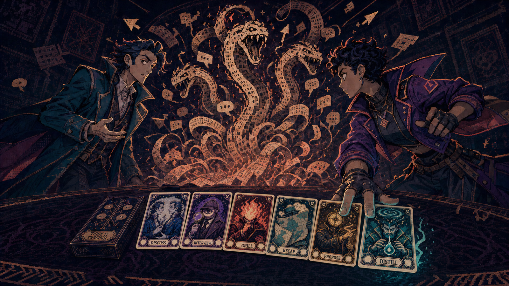

# Think It Through

**Your thoughts don’t need to arrive organized. Dump freely. Play a card when you need the thought to move.**

Think It Through is an open-source deck for developing ideas with an agent.
Write the thought as it arrives, even when fragmented or overloaded. Play a
card to make the next move explicit without composing another prompt.



## Dump first. Shape when needed.

I use AI before an idea is ready, so my messages start doing two jobs:

```text
The product may be a method, an interface, and a protocol. Some of those ideas
overlap, but perhaps I am forcing them together.

Separate the ideas. Clarify each one without merging them. Preserve useful
connections, and do not choose a direction yet.
```

The first paragraph is the thought. The second is a response contract I kept
rewriting.

`DISTILL` turns it into a card:

```text
The product may be a method, an interface, and a protocol. Some of those ideas
overlap, but perhaps I am forcing them together.

/distill
```


The card carries that contract. Without one, the agent responds as usual.

The deck follows the way the work unfolds:

```text
dump freely
→ DISTILL
→ DISCUSS or FURTHER
→ GRILL
→ PROPOSE

pause
→ RECAP
→ continue
```

Use only the steps the thought needs. Their names stay stable when you pause or
resume.

## See `DISTILL` play

**Human**

```text
The product may be a method, an interface, and a protocol. Some of those ideas
overlap, but perhaps I am forcing them together.

/distill
```

**Agent**

> 🎯 **Latest message** → 🧪 **DISTILL**

**Distilled**

- A method is a repeatable way of working.
- An interface is how a person directs and observes the work.
- A protocol supplies rules that different implementations can follow.

**Connections**

The three ideas may describe layers of one system. The thought does not
establish that they must share one product boundary. A method can prescribe a
way of working while a protocol stays neutral about the method.

**Response**

The unresolved question is which layer people would adopt first: the method,
the interface, or the protocol. The other two may support it without belonging
to the same initial product boundary.

`DISTILL` clarified the material without choosing a direction.

## Install and play

Install the HACP session adapter once, then the deck. Without a compatible
adapter the commands may appear, but the session is not fully HACP-conforming.

### Codex

```bash
codex plugin marketplace add control-decks/human-agent-control-protocol
codex plugin add hacp@hacp
codex plugin marketplace add control-decks/think-it-through
codex plugin add think-it-through@think-it-through
```

Use `$think-it-through:help` or play
`$think-it-through:distill`.

### Claude Code

```bash
claude plugin marketplace add control-decks/human-agent-control-protocol --scope user
claude plugin install hacp@hacp --scope user
claude plugin marketplace add control-decks/think-it-through --scope user
claude plugin install think-it-through@think-it-through --scope user
```

Use `/think-it-through:help` or play
`/think-it-through:distill`.

The examples below use the portable shorthand `/<card>`.

## Start with six cards

Six cards cover the recurring thinking moves.

| When your thinking needs... | Play | The agent will... |
| --- | --- | --- |
| structure | [🧪 `DISTILL`](plugins/think-it-through/skills/distill/SKILL.md) | separate and clarify the thought |
| room to develop | [💬 `DISCUSS`](plugins/think-it-through/skills/discuss/SKILL.md) | develop implications already present |
| one new edge | [🚀 `FURTHER`](plugins/think-it-through/skills/further/SKILL.md) | add one grounded extension, then stop |
| pressure | [🔥 `GRILL`](plugins/think-it-through/skills/grill/SKILL.md) | test one weak branch per exchange |
| orientation | [🗺️ `RECAP`](plugins/think-it-through/skills/recap/SKILL.md) | recover a map and synthesis |
| a direction | [🧭 `PROPOSE`](plugins/think-it-through/skills/propose/SKILL.md) | offer one choice with its tradeoff and risk |

`DISCUSS` stays inside the thought and develops implications already present.
`FURTHER` crosses its current edge once with a supported extension, marks the
leap, then stops. Repeat, switch, or return to normal conversation as needed.

If a long session has lost its shape, send:

```text
/recap
```

`RECAP` uses the conversation by default. The same vocabulary reduces prompt
writing and recovery work across sessions. Cards control the requested move,
not correctness or cross-session memory; you still verify the result.

## Combine two cards

Cards pass their results from left to right:

```text
The product may be a method, an interface, and a protocol.

/distill
+ /propose
```

```text
🎯 Latest message → 🧪 DISTILL → 🧭 PROPOSE
```

`DISTILL` clarifies first. `PROPOSE` receives that result and selects one
direction with its tradeoff and risk.

## Stay with a hard question

Some cards need more than one exchange:

```text
I think the interface should be the first product.

/grill
```

```text
🎯 Current testable idea → 🔥 GRILL

Recommendation
Treat the interface as the adoption surface, but keep the method optional.

Question
If the protocol vanished tomorrow, what value would the interface still
deliver on its own?
```

`GRILL` stays active until its verdict or until you stop it. `INTERVIEW` uses
the same multi-exchange shape to build shared understanding.

## The rules are short

- Keep writing as usual when you do not need a card.
- You play each card. The agent does not choose a move for you.
- Resolve combos from left to right against one Binding.
- Clear most cards after one agent response.
- Keep `INTERVIEW` and `GRILL` active until they finish or you stop them.
- Create briefs and plans when you play their cards.

## Add control when you need it

Ten advanced cards select Bindings, gather information, recommend actions,
create artifacts, or change a result's presentation.

`/help` gives exact commands without playing a card:

```text
/help
/help distill
/help "I need to choose a direction"
```

Binding cards target a conversation, topic, or axis. Output cards create a brief
or plan. Presentation cards explain or render the current Working Object. For
example:

```text
/recap + /with-diagrams
```

```text
🎯 Conversation → 🗺️ RECAP + 📊 DIAGRAMS
```

```text
/explain + /with-diagrams
```

`EXPLAIN` preserves claims and caveats; `DIAGRAMS` adds one useful visual.

`/to-plan` prepares an accepted or provisional direction for review. It does
not authorize execution.

`/explain` can consume any compatible HACP result:

```text
$work-this-way:implement
+ $think-it-through:explain
```

`EXPLAIN` presents the observed implementation result without changing it.

## Under the deck

Think It Through controls response shape. Methods, project rules, and tools
govern substance and actions.

The
[Human-Agent Control Protocol](https://github.com/control-decks/human-agent-control-protocol)
Draft 0.4 loads the shared session rules: Binding, Working Object transfer,
control state, duration, and visible resolution. Cards stay human-only; the
agent cannot infer or replay them.

| Layer | Owns |
| --- | --- |
| Think It Through | purpose, card-local mental model, cards, and defaults |
| HACP | Binding, object transfer, control state, order, and clearing |
| Methods and project rules | reasoning and quality constraints |
| Providers and tools | instruction loading, context, and actions |

<details>
<summary><strong>Complete card reference</strong></summary>

There is no deck initializer or root resolver. `help` explains the deck but is
not a card. `Conversation → Topics → Axes` appears only in the binding, recap,
and help surfaces that need it.

### Operation cards

| Card | Play when | Default binding | Result | Duration |
| --- | --- | --- | --- | --- |
| [🧪 Distill](plugins/think-it-through/skills/distill/SKILL.md) | Thoughts need structure | Latest human message | Clear thoughts | One agent turn |
| [💬 Discuss](plugins/think-it-through/skills/discuss/SKILL.md) | Exploration should stay open | Current thought | Developed thought | One agent turn |
| [🔎 Interview](plugins/think-it-through/skills/interview/SKILL.md) | Understanding is missing | Smallest unclear subject | Shared understanding | Multiple exchanges |
| [🔥 Grill](plugins/think-it-through/skills/grill/SKILL.md) | An idea needs pressure | Current testable idea | Verdict and risks | Multiple exchanges |
| [🗺️ Recap](plugins/think-it-through/skills/recap/SKILL.md) | Orientation is lost | Available conversation | Map and synthesis | One agent turn |
| [🧭 Propose](plugins/think-it-through/skills/propose/SKILL.md) | An open question needs direction | Current open decision | One proposal | One agent turn |
| [⚡ Next](plugins/think-it-through/skills/next/SKILL.md) | Action should follow | Latest actionable result | One to three actions | One agent turn |
| [🚀 Further](plugins/think-it-through/skills/further/SKILL.md) | A useful idea should be pushed beyond its current edge | Current Working Object | One grounded creative extension | One agent turn |

### Binding cards

| Card | Chooses | Duration |
| --- | --- | --- |
| [🎯 Conversation](plugins/think-it-through/skills/on-conversation/SKILL.md) | All available topics and axes | One combo |
| [🎯 Topic](plugins/think-it-through/skills/on-topic/SKILL.md) | One topic | One combo |
| [🎯 Axis](plugins/think-it-through/skills/on-axis/SKILL.md) | One axis | One combo |

### Output cards

| Card | Creates | Default binding |
| --- | --- | --- |
| [📄 Brief](plugins/think-it-through/skills/to-brief/SKILL.md) | Portable thinking checkpoint | Available conversation |
| [📋 Plan](plugins/think-it-through/skills/to-plan/SKILL.md) | Execution plan for review | Accepted or provisional direction |

### Presentation cards

| Card | Presents | Default binding |
| --- | --- | --- |
| [💡 Explain](plugins/think-it-through/skills/explain/SKILL.md) | Concise contextual explanation | Current Working Object |
| [📊 Diagrams](plugins/think-it-through/skills/with-diagrams/SKILL.md) | Smallest useful visual | Final or latest useful result |
| [🧠 Reasoning map](plugins/think-it-through/skills/with-reasoning-map/SKILL.md) | Supported reasoning structure | Final reasoning or current decision |

</details>

## Build your own card

Start with an instruction you repeat:

```text
repeated instruction
→ define one effect and default binding
→ define result, duration, and limits
→ test positions and cross-deck transfer
→ keep, revise, merge, or remove
```

A Draft 0.4 card contract records:

```text
ID → Kind/Mode/Traits → Default Binding → Accepts
→ Requires (when needed) → Produces → Duration → Effect → Limits
```

A different deck can use the same interaction rules for another purpose and
mental model. Share an instruction you repeat in a
[GitHub issue](https://github.com/control-decks/think-it-through/issues).

## Origin and license

Grill Me was the seed: one short command for one reusable conversation
contract. Think It Through extracted more repeated instructions into cards. I
derived the HACP draft from this first implementation; one deck cannot prove a
universal standard.

Think It Through is available under the [MIT License](LICENSE).
