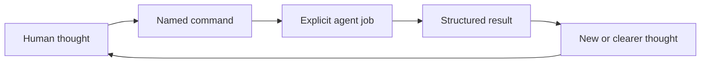

# Think It Through

**Think freely. The agent follows your lead.**

Think It Through is a lightweight command palette for developing ideas with AI across long, branching conversations.

Each command gives the agent one job and a useful default target, so you can write the thought and choose what happens next.

## Why commands

Ideas arrive as fragments, revisions, and sudden connections. The next agent response still needs direction.

You end up mixing the thought with instructions:

> This could be a command palette, a deck, or a human-agent interface. Separate the ideas, preserve what differs, connect what belongs together, then tell me what you think.

The first sentence is your thought. The rest is an instruction you may repeat tomorrow.

Think It Through names that instruction. Without a command, the agent responds normally. With one, its job, target, and result become explicit.

## See it once

Write the thought as it arrives:

```text
Command palette, visual deck, human-agent UX. These ideas may connect.
/think-distill
```

The result:

```text
> 🎯 Latest message → 🧪 DISTILL

Distilled
- Command palette: the interface.
- Starter deck: its visual presentation.
- Human-agent UX: the wider problem.

Connections
The palette can use a deck presentation inside the wider UX.

Response
Lead with command palette. It says what the product does.
```

`think-distill` separated, clarified, connected only what belonged together, then responded. Every card defines a concrete contract.

Think It Through adds a domain-neutral conversation control layer to your method.

## How it works

You supply ideas, intent, taste, and judgment. A command states the work you want next. The agent clarifies, connects, questions, challenges, or reconstructs. The result feeds your next thought.



Commands shape one response. Repeat, switch, or talk normally. Only `interview` and `grill` continue across turns.

## Start with six commands

These six are my recommended generic starting points in the 15-card starter deck. They remain revisable.

### 🧪 [`/think-distill`](plugins/think-it-through/skills/think-distill/SKILL.md)

Messy thoughts. Default: latest message. `separate → clarify → connect when supported` Result: articulated thoughts.

### 💬 [`/think-discuss`](plugins/think-it-through/skills/think-discuss/SKILL.md)

Open exploration. Default: current thought. `recover → develop → keep open` Result: deeper thinking without a forced conclusion.

### 🔎 [`/think-interview`](plugins/think-it-through/skills/think-interview/SKILL.md)

Context is missing. Default: smallest unclear subject. `research → ask → integrate → repeat` Result: neutral shared understanding.

### 🔥 [`/think-grill`](plugins/think-it-through/skills/think-grill/SKILL.md)

A proposal needs pressure. Default: current testable idea. `map → recommend → question → repeat` Result: robustness, rejection, or explicit risks.

### 🗺️ [`/think-recap`](plugins/think-it-through/skills/think-recap/SKILL.md)

A conversation has lost its shape. Default: available conversation. `recover → map → synthesize` Result: checkpoint with reusable labels.

### 🧭 [`/think-propose`](plugins/think-it-through/skills/think-propose/SKILL.md)

An open decision needs direction. Default: current open question. `evaluate → choose → expose tradeoff and risk` Result: strong proposal; you decide.

## Keep your place

Commands answer **what next?** The map answers **where are we?**

```text
Conversation
└── Topics
    └── Axes
        ├── ideas and assumptions
        ├── proposals and decisions
        ├── tensions and contradictions
        └── open questions
```

`/think-it-through` adopts the map silently. `/think-recap` reveals topic and axis names. `/think-on-*` selects a branch. `/think-to-brief` saves a checkpoint.

The map uses available context and supplied material. A new session resumes only from a supplied brief or its contents. There is no hidden memory or synchronization.

> Distill the message. Recover the session. Preserve what matters.

## Install

This README uses portable notation. Provider syntax differs:

| Portable | Codex | Claude Code |
| --- | --- | --- |
| `/think-recap` | `$think-it-through:think-recap` | `/think-it-through:think-recap` |

### Codex

```bash
codex plugin marketplace add thevzion/think-it-through
codex plugin add think-it-through@think-it-through
```

### Claude Code

```bash
claude plugin marketplace add thevzion/think-it-through --scope user
claude plugin install think-it-through@think-it-through --scope user
```

## Build a combo

Each card works alone through its default. Combine cards for more control:

```text
🎯 Topic: Positioning → 🧪 DISTILL → 🧭 PROPOSE → 📄 BRIEF + 📊 DIAGRAMS
└── target              └── job      └── job       └── artifact └── modifier
```

The trace reads like a query and runs like a pipeline. A **selector** chooses the **target**. Jobs transform it left to right. An **output** produces a structured **artifact** such as an inline or saved brief, plan, spec, decision note, or set of notes. Modifiers change representation, never substance.

The composable command syntax has five card types:

```text
SESSION                         standalone
SELECTOR? → JOB* → OUTPUT? → MODIFIER*
```

Type sets order even when you write cards differently. One selector applies, then clears. An output uses the final result or its default. Modifiers read that result, not each other. Conflicts require clarification.

`→` passes a result or creates an artifact. `+` adds representation. Natural conversation stays silent. A selector alone answers `Target set: … · Applies to: next combo`.

For technical readers, the syntax behaves like a small domain-agnostic DSL.

## Full command reference

The other cards add optional session, target, representation, and artifact control.

| Command | Type | Default target | Result | Runs for |
| --- | --- | --- | --- | --- |
| [🧩 `/think-it-through`](plugins/think-it-through/skills/think-it-through/SKILL.md) | Session | Current focus | Session map | Session |
| [🧪 `/think-distill`](plugins/think-it-through/skills/think-distill/SKILL.md) | Job | Latest message | Clarified thoughts | One response |
| [💬 `/think-discuss`](plugins/think-it-through/skills/think-discuss/SKILL.md) | Job | Current thought | Open exploration | One response |
| [🔎 `/think-interview`](plugins/think-it-through/skills/think-interview/SKILL.md) | Job | Unclear subject | Shared understanding | Multi-turn |
| [🔥 `/think-grill`](plugins/think-it-through/skills/think-grill/SKILL.md) | Job | Testable idea | Verdict or risks | Multi-turn |
| [🗺️ `/think-recap`](plugins/think-it-through/skills/think-recap/SKILL.md) | Job | Available conversation | Map and synthesis | One response |
| [🧭 `/think-propose`](plugins/think-it-through/skills/think-propose/SKILL.md) | Job | Open question | Strong direction | One response |
| [⚡ `/think-next`](plugins/think-it-through/skills/think-next/SKILL.md) | Job | Actionable result | Next actions | One response |
| [🎯 `/think-on-conversation`](plugins/think-it-through/skills/think-on-conversation/SKILL.md) | Selector | Conversation | Target | One combo |
| [🎯 `/think-on-topic`](plugins/think-it-through/skills/think-on-topic/SKILL.md) | Selector | Topic | Target | One combo |
| [🎯 `/think-on-axis`](plugins/think-it-through/skills/think-on-axis/SKILL.md) | Selector | Axis | Target | One combo |
| [📄 `/think-to-brief`](plugins/think-it-through/skills/think-to-brief/SKILL.md) | Output | Conversation or final result | Thinking Brief | One output |
| [📋 `/think-to-plan`](plugins/think-it-through/skills/think-to-plan/SKILL.md) | Output | Executable direction | Execution Plan | One output |
| [📊 `/think-with-diagrams`](plugins/think-it-through/skills/think-with-diagrams/SKILL.md) | Modifier | Final result | Diagram | One response |
| [🧠 `/think-with-reasoning-map`](plugins/think-it-through/skills/think-with-reasoning-map/SKILL.md) | Modifier | Final reasoning | Reasoning map | One response |

## Fit it to your stack

Use it across domains, inside [Superpowers](https://github.com/obra/superpowers), with [Ponytail](https://github.com/DietrichGebert/ponytail) or [Stop Slop](https://github.com/hardikpandya/stop-slop), and alongside your templates. [Compound Engineering](https://github.com/EveryInc/compound-engineering-plugin) and [Compound Knowledge](https://github.com/EveryInc/compound-knowledge-plugin) preserve learning across cycles; this palette handles the conversation producing it.

## Make a command from something you keep repeating

`/think-distill` began as: “Separate these thoughts, clarify each, show supported connections, then respond.” Naming it removed repetition.

Use the same test:

```text
repeated instruction
→ define one job and useful default
→ define result and limits
→ test across subjects
→ keep, revise, merge, or remove
```

A full card uses:

```text
Context → Use when → Default target → Job → Result
→ Runs for → Limits → Combines with → Flow → Format
```

Keep domain cards in your stack. Share one when it recurs, stays distinct, and composes. [Open an issue](https://github.com/thevzion/think-it-through/issues) for obstructive defaults, overlaps, or missing instructions.

## Origin and license

Grill Me supplied the seed: a short name for a reusable response contract. Think It Through extends that pattern across complex conversations.

License: [MIT](LICENSE).
