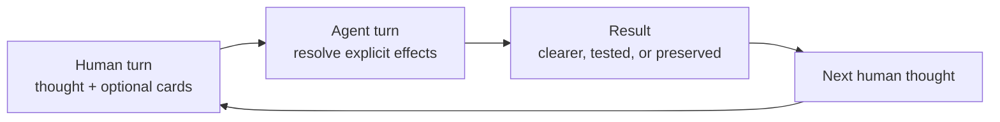

# Think It Through

**Think freely. The agent follows your lead.**

Think It Through is the first thinking deck built on the [Human-Agent Card Protocol](https://github.com/thevzion/human-agent-card-protocol).

Develop complex ideas with 14 cards. Talk normally, then play one for specific help.

> Conversation Cards are the interface. HACP defines how they work. Think It Through is the first deck.

Each slash command plays a self-describing card with a clear effect, default, duration, and result. Spend less attention instructing the agent and more attention developing the thought.

## See it once

Suppose this is the thought:

> The product may be a method, an interface, and a protocol. Some of those ideas overlap, but perhaps I am forcing them together.

Send it alone and the agent chooses how to respond.

You can steer it manually:

> Separate the ideas first. Clarify each one without merging them. Then show only the relationships supported by what I said, and respond after that.

The instruction works, but it is longer than the thought and recurs.

Or play a card:

```text
The product may be a method, an interface, and a protocol. Some of those
ideas overlap, but perhaps I am forcing them together.

/think-distill
```

```text
🎯 Latest message → 🧪 DISTILL
```

`DISTILL` returns distinct, clear statements, then supported connections or tensions. The command stays short because the full contract lives in the card.

## How to play

A **human turn** supplies a thought and may play cards. An **agent turn** resolves their effects. Together they form an **exchange**.



Most cards last one agent turn. `INTERVIEW` and `GRILL` continue until they produce a result or you interrupt them. Focus cards last one combo. Outputs run until creation or cancellation. Modifiers affect one final representation.

Without a card, conversation stays normal. No move card plays silently.

Cards carry the shared rules. `/think-it-through` initializes the deck but is not required.

## This deck

You supply ideas, intent, taste, and judgment. Cards state the next effect. The agent follows that direction while connecting, questioning, and reconstructing context.

> You play the cards. The agent keeps this deck's map and applies their effects.

The deck uses one navigation model:

```text
Conversation
└── Topics
    └── Axes
        ├── ideas and assumptions
        ├── proposals and decisions
        ├── tensions and contradictions
        └── open questions
```

Topics are major subjects. Axes are stable branches in active, paused, resolved, or replaced states. The agent rebuilds the map from available context and supplied checkpoints, without promising persistent memory.

The map organizes conversation, not the domain. Your methods, skills, conventions, and templates still govern substance and documents.

## Start with six cards

I recommend these six cards first. I built them from instructions repeated in my own conversations, not universal fundamentals.

- [🧪 `/think-distill`](plugins/think-it-through/skills/think-distill/SKILL.md): separate and clarify thoughts, then expose supported relationships.
- [💬 `/think-discuss`](plugins/think-it-through/skills/think-discuss/SKILL.md): develop the current thought without forcing a conclusion.
- [🔎 `/think-interview`](plugins/think-it-through/skills/think-interview/SKILL.md): resolve missing understanding through one focused question at a time.
- [🔥 `/think-grill`](plugins/think-it-through/skills/think-grill/SKILL.md): pressure-test a branch with a recommendation and question on each exchange.
- [🗺️ `/think-recap`](plugins/think-it-through/skills/think-recap/SKILL.md): recover the conversation as a navigable map and overall synthesis.
- [🧭 `/think-propose`](plugins/think-it-through/skills/think-propose/SKILL.md): offer one strong direction with its tradeoff and main risk.

Repeat or switch cards as your thought changes.

## Build a combo

A combo resolves several cards together:

```text
Intent
"On Positioning, clarify the discussion, propose one direction,
turn it into a brief, and add a diagram."

Commands
/think-on-topic "Positioning"
+ /think-distill
+ /think-propose
+ /think-to-brief
+ /think-with-diagrams

Trace
🎯 Topic: Positioning → 🧪 DISTILL → 🧭 PROPOSE → 📄 BRIEF + 📊 DIAGRAMS
```

The grammar is:

```text
FOCUS? → MOVE* → OUTPUT? → MODIFIER*
```

A focus card chooses the subject. Moves pass results left to right. One output may create an artifact. Modifiers change its representation, not its substance. Defaults let most cards work alone.

## Recover, preserve, or act

`/think-recap` exposes the map. Reuse its labels with `/think-on-topic` or `/think-on-axis`.

`/think-to-brief` creates a portable checkpoint. Provide it to resume in another session.

`/think-to-plan` turns an accepted or provisional direction into an operational artifact. It requires validation and never authorizes execution.

Traces stay in the conversation. Briefs and plans use the vocabulary and structure of their domain, not HACP or deck metadata.

## Install

Codex:

```bash
codex plugin marketplace add thevzion/think-it-through
codex plugin add think-it-through@think-it-through
```

Play a card with `$think-it-through:think-distill`.

Claude Code:

```bash
claude plugin marketplace add thevzion/think-it-through --scope user
claude plugin install think-it-through@think-it-through --scope user
```

Play the same card with `/think-it-through:think-distill`.

This README uses portable shorthand such as `/think-distill`.

## The current deck

I built the other cards through the same practice. They may stay, evolve, merge, or leave as use provides evidence.

Optional initialization: use [🧩 `/think-it-through`](plugins/think-it-through/skills/think-it-through/SKILL.md) to load the shared deck model. It is not a card.

### Move cards

| Card | Play when | Works on by default | Result | Duration |
| --- | --- | --- | --- | --- |
| [🧪 Distill](plugins/think-it-through/skills/think-distill/SKILL.md) | Thoughts need structure | Latest human message | Clear thoughts | One agent turn |
| [💬 Discuss](plugins/think-it-through/skills/think-discuss/SKILL.md) | Exploration should stay open | Current thought | Developed thought | One agent turn |
| [🔎 Interview](plugins/think-it-through/skills/think-interview/SKILL.md) | Understanding is missing | Smallest unclear subject | Shared understanding | Multiple exchanges |
| [🔥 Grill](plugins/think-it-through/skills/think-grill/SKILL.md) | An idea needs pressure | Current testable idea | Verdict and risks | Multiple exchanges |
| [🗺️ Recap](plugins/think-it-through/skills/think-recap/SKILL.md) | Orientation is lost | Available conversation | Map and synthesis | One agent turn |
| [🧭 Propose](plugins/think-it-through/skills/think-propose/SKILL.md) | An open question needs direction | Current open decision | One proposal | One agent turn |
| [⚡ Next](plugins/think-it-through/skills/think-next/SKILL.md) | Action should follow | Latest actionable result | One to three actions | One agent turn |

### Focus cards

| Card | Chooses | Duration |
| --- | --- | --- |
| [🎯 Conversation](plugins/think-it-through/skills/think-on-conversation/SKILL.md) | All available topics and axes | One combo |
| [🎯 Topic](plugins/think-it-through/skills/think-on-topic/SKILL.md) | One topic | One combo |
| [🎯 Axis](plugins/think-it-through/skills/think-on-axis/SKILL.md) | One axis | One combo |

### Output cards

| Card | Creates | Uses by default |
| --- | --- | --- |
| [📄 Brief](plugins/think-it-through/skills/think-to-brief/SKILL.md) | Portable thinking checkpoint | Available conversation |
| [📋 Plan](plugins/think-it-through/skills/think-to-plan/SKILL.md) | Execution plan for review | Accepted or provisional direction |

### Modifier cards

| Card | Adds | Keeps unchanged |
| --- | --- | --- |
| [📊 Diagrams](plugins/think-it-through/skills/think-with-diagrams/SKILL.md) | Smallest useful visual | Substance and uncertainty |
| [🧠 Reasoning map](plugins/think-it-through/skills/think-with-reasoning-map/SKILL.md) | Supported reasoning structure | Evidence and conclusions |

## Build your own card

[HACP](https://github.com/thevzion/human-agent-card-protocol) separates shared interaction rules from a deck. A card starts with an instruction you repeat:

```text
repeated instruction
→ define one effect and useful default
→ define result, duration, and limits
→ test across subjects
→ keep, revise, merge, or remove
```

Its full contract is:

```text
Use when → Works on by default → Effect → Result → Duration
→ Limits → Combines with → Flow → Format
```

A future deck can define another purpose, mental model, and card set on the same rules.

Which instruction do you repeat often enough to turn into a card? [Open an issue](https://github.com/thevzion/think-it-through/issues) to share one, challenge a default, flag an overlap, or suggest a missing effect.

## Origin and license

Grill Me was the seed: one short command for one reusable conversation contract. Think It Through extracted more repeated instructions into cards. I derived the HACP draft from this first implementation; one deck cannot prove a universal standard.

I publish Think It Through under the [MIT License](LICENSE).
