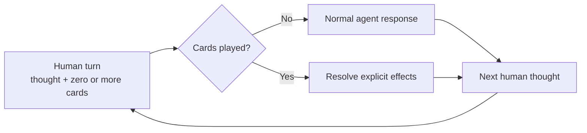

# Think It Through

**Think freely. The agent follows your lead.**

Think It Through is the first thinking deck built on the [Human-Agent Card Protocol](https://github.com/thevzion/human-agent-card-protocol).

Develop complex ideas with 14 conversation cards. Talk normally, then play a card when you want the agent to clarify, explore, question, challenge, recover, or preserve the thought.

Each command plays a card with a default focus, effect, result, and duration. Spend less attention instructing the agent and more attention developing the thought.

## See it once

Suppose this is the thought:

> The product may be a method, an interface, and a protocol. Some of those ideas overlap, but perhaps I am forcing them together.

Send it alone and the agent chooses how to respond. Or steer it manually:

> Separate the ideas first. Clarify each one without merging them. Then show only the relationships supported by what I said, and respond.

The instruction works, but it recurs. Play a card instead:

```text
The product may be a method, an interface, and a protocol. Some of those
ideas overlap, but perhaps I am forcing them together.

/think-distill
```

```text
🎯 Latest message → 🧪 DISTILL
```

`DISTILL` returns distinct statements, then supported connections or tensions. Its contract lives in the card.

HACP is semantic rather than transport-level. It defines card meaning, composition, and clearing, not provider loading, transport, or memory.

## How cards play

A **human turn** supplies a thought and zero or more cards. An **agent turn** resolves their effects. Together they form an **exchange**.



Cards work at conversation speed. Play one when the next agent turn matters, including on successive turns. Otherwise, talk normally.

Most cards last one agent turn. `INTERVIEW` and `GRILL` span exchanges. Focus cards last one combo, outputs last through creation, and modifiers affect one representation.

Every play stays explicit. A cleared card never repeats from cadence alone, and no move card plays silently.

## This deck

You supply ideas and judgment. Cards state the next effect. The agent connects, questions, and reconstructs context.

> You play the cards. The agent keeps this deck's map and applies their effects.

```text
Conversation
└── Topics
    └── Axes
        ├── ideas and assumptions
        ├── proposals and decisions
        ├── tensions and contradictions
        └── open questions
```

Topics are major subjects. Axes are active, paused, resolved, or replaced branches. The agent rebuilds the map from available context and supplied checkpoints, without promising persistent memory.

The map organizes conversation, not the domain. Your methods, skills, conventions, and templates still govern substance and documents.

## Start with six cards

I recommend these six first. They came from my repeated instructions, not universal fundamentals.

- [🧪 `/think-distill`](plugins/think-it-through/skills/think-distill/SKILL.md): separate and clarify thoughts, then expose supported relationships.
- [💬 `/think-discuss`](plugins/think-it-through/skills/think-discuss/SKILL.md): develop the current thought without forcing a conclusion.
- [🔎 `/think-interview`](plugins/think-it-through/skills/think-interview/SKILL.md): resolve missing understanding through one focused question at a time.
- [🔥 `/think-grill`](plugins/think-it-through/skills/think-grill/SKILL.md): pressure-test a branch with a recommendation and question on each exchange.
- [🗺️ `/think-recap`](plugins/think-it-through/skills/think-recap/SKILL.md): recover the conversation as a navigable map and overall synthesis.
- [🧭 `/think-propose`](plugins/think-it-through/skills/think-propose/SKILL.md): offer one strong direction with its tradeoff and main risk.

Repeat or switch cards as your thought changes.

## Ask the deck

`/think-help` recommends normal conversation, one card, or a combo from the current situation. It also explains cards and deck concepts:

```text
/think-help
/think-help distill
/think-help "I need to choose a direction"
```

Help gives exact commands but never plays them. Use `/think-next` for actions inside your subject.

## Defaults and combos

Every card declares a `Default focus`. When you omit a focus card, the agent resolves that value directly and shows it in the trace:

```text
/think-recap

Default focus → available conversation
Trace         → 🎯 Conversation → 🗺️ RECAP
```

A focus card overrides the default for one combo:

```text
/think-on-axis "Artifacts" + /think-recap

Override → axis "Artifacts"
Trace    → 🎯 Axis: Artifacts → 🗺️ RECAP
```

No hidden focus card runs in the first example.

Several cards form a combo:

```text
Intent
"On Positioning, clarify the discussion, propose one direction,
turn it into a brief, and add a diagram."

Commands
/think-on-topic "Positioning"
+ /think-distill
+ /think-propose
+ /think-to-brief
+ /think-with-diagrams

Trace
🎯 Topic: Positioning → 🧪 DISTILL → 🧭 PROPOSE → 📄 BRIEF + 📊 DIAGRAMS
```

HACP resolves `FOCUS? → MOVE* → OUTPUT? → MODIFIER*`. Moves pass results left to right. One output may create an artifact. Modifiers change representation, not substance.

## Recover, preserve, or act

`/think-recap` exposes the map. Reuse its labels with `/think-on-topic` or `/think-on-axis`. `/think-to-brief` creates a portable checkpoint for another session. `/think-to-plan` turns an accepted or provisional direction into a plan for validation, never authorization to execute.

Traces stay in the conversation. Briefs and plans use the vocabulary and structure of their domain, not HACP or deck metadata.

## Install

Codex:

```bash
codex plugin marketplace add thevzion/think-it-through
codex plugin add think-it-through@think-it-through
```

Use `$think-it-through:think-help` or play `$think-it-through:think-distill`.

Claude Code:

```bash
claude plugin marketplace add thevzion/think-it-through --scope user
claude plugin install think-it-through@think-it-through --scope user
```

Use `/think-it-through:think-help` or play `/think-it-through:think-distill`.

Examples use portable shorthand such as `/think-help`.

## The current deck

I built the other cards through the same practice. They may stay, evolve, merge, or leave as use provides evidence.

[🧩 `/think-it-through`](plugins/think-it-through/skills/think-it-through/SKILL.md) initializes the shared deck model. [🧩 `/think-help`](plugins/think-it-through/skills/think-help/SKILL.md) explains the deck. Neither is a card.

### Move cards

| Card | Play when | Default focus | Result | Duration |
| --- | --- | --- | --- | --- |
| [🧪 Distill](plugins/think-it-through/skills/think-distill/SKILL.md) | Thoughts need structure | Latest human message | Clear thoughts | One agent turn |
| [💬 Discuss](plugins/think-it-through/skills/think-discuss/SKILL.md) | Exploration should stay open | Current thought | Developed thought | One agent turn |
| [🔎 Interview](plugins/think-it-through/skills/think-interview/SKILL.md) | Understanding is missing | Smallest unclear subject | Shared understanding | Multiple exchanges |
| [🔥 Grill](plugins/think-it-through/skills/think-grill/SKILL.md) | An idea needs pressure | Current testable idea | Verdict and risks | Multiple exchanges |
| [🗺️ Recap](plugins/think-it-through/skills/think-recap/SKILL.md) | Orientation is lost | Available conversation | Map and synthesis | One agent turn |
| [🧭 Propose](plugins/think-it-through/skills/think-propose/SKILL.md) | An open question needs direction | Current open decision | One proposal | One agent turn |
| [⚡ Next](plugins/think-it-through/skills/think-next/SKILL.md) | Action should follow | Latest actionable result | One to three actions | One agent turn |

### Focus cards

| Card | Chooses | Duration |
| --- | --- | --- |
| [🎯 Conversation](plugins/think-it-through/skills/think-on-conversation/SKILL.md) | All available topics and axes | One combo |
| [🎯 Topic](plugins/think-it-through/skills/think-on-topic/SKILL.md) | One topic | One combo |
| [🎯 Axis](plugins/think-it-through/skills/think-on-axis/SKILL.md) | One axis | One combo |

### Output cards

| Card | Creates | Default focus |
| --- | --- | --- |
| [📄 Brief](plugins/think-it-through/skills/think-to-brief/SKILL.md) | Portable thinking checkpoint | Available conversation |
| [📋 Plan](plugins/think-it-through/skills/think-to-plan/SKILL.md) | Execution plan for review | Accepted or provisional direction |

### Modifier cards

| Card | Adds | Default focus |
| --- | --- | --- |
| [📊 Diagrams](plugins/think-it-through/skills/think-with-diagrams/SKILL.md) | Smallest useful visual | Final or latest useful result |
| [🧠 Reasoning map](plugins/think-it-through/skills/think-with-reasoning-map/SKILL.md) | Supported reasoning structure | Final reasoning or current decision |

## Build your own card

[HACP](https://github.com/thevzion/human-agent-card-protocol) separates shared interaction rules from a deck. Start with an instruction you repeat:

```text
repeated instruction
→ define one effect and default focus
→ define result, duration, and limits
→ test across subjects
→ keep, revise, merge, or remove
```

Its card contract is:

```text
Use when → Default focus → Effect → Result
→ Duration → Limits → Flow → Format
```

A future deck can define another purpose, mental model, card set, and help entrypoint on the same rules.

Which instruction do you repeat often enough to turn into a card? [Open an issue](https://github.com/thevzion/think-it-through/issues) to share one, challenge a default, flag an overlap, or suggest a missing effect.

## Origin and license

Grill Me was the seed: one short command for one reusable conversation contract. Think It Through extracted more repeated instructions into cards. I derived the HACP draft from this first implementation; one deck cannot prove a universal standard.

I publish Think It Through under the [MIT License](LICENSE).
