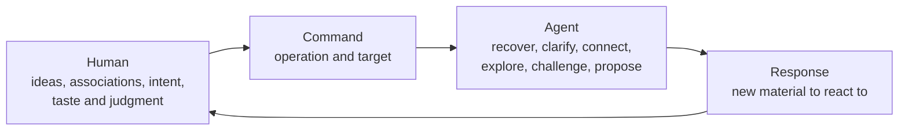

# Think It Through

**Write the thought. Command the next move.**

Develop complex ideas with AI without losing control of the conversation.

Think It Through is a domain-neutral conversation control layer for human thinking. Its command palette gives the agent a named job and a useful default target, so your message can stay focused on the idea.

Talk to the agent as you do now. Add a command when you want a specific kind of help.

## Why commands

In a long session, you jump between fragments, questions, revisions, and decisions.

The agent still needs a clear job. You often mix the thought with instructions about the next response:

> Separate these ideas. Clarify each one. Keep unrelated ideas apart. Show me where they connect, then respond without jumping to a solution.

Think It Through gives those instructions short names. You write the thought and invoke a command. The command defines the next job and target; the agent generates the substance.

Without a command, the agent responds as usual.

## See it once

**Without a named command**

> Maybe this is a command palette, but deck feels more visual. It may also be a human-agent UX layer. Those ideas could converge, though I do not want you to merge them too early. First list each thought, show connections only when they hold, then tell me what you think.

**With a named command**

> Maybe this is a command palette, but deck feels more visual. It may also be a human-agent UX layer. Those ideas could converge.
>
> `/think-distill`

> 🎯 **Latest message** → 🧪 **DISTILL**
>
> **Distilled**
>
> - Command palette describes the human interface.
> - Starter deck gives that palette a visual, extensible form.
>
> **Connections**
>
> The palette can be the interface and the deck its presentation.
>
> **Response**
>
> Lead with command palette. Use deck when you show the cards.

`think-distill` structures the message without erasing distinctions.

## How it works

The human brings ideas, intent, taste, and judgment. A command names the operation and target. The agent recovers context, explores, challenges, or proposes. The human can accept, reject, combine, or reframe its response.



Commands make the requested operation predictable. They do not make generated content deterministic.

## Start with six commands

### 🧪 [`/think-distill`](plugins/think-it-through/skills/think-distill/SKILL.md)

**Use when:** ideas arrive faster than you can structure them.

**Default:** latest human message.

`separate → clarify → connect when supported`

**Result:** clear thoughts and a response.

### 💬 [`/think-discuss`](plugins/think-it-through/skills/think-discuss/SKILL.md)

**Use when:** you want to keep exploring without forcing a conclusion.

**Default:** thought currently being expressed.

`recover context → explore → keep open`

**Result:** open exploration.

### 🔎 [`/think-interview`](plugins/think-it-through/skills/think-interview/SKILL.md)

**Use when:** the agent needs to understand your intent or constraints.

**Default:** smallest current subject with a material understanding gap.

`find gap → ask → integrate → repeat`

**Result:** shared understanding, one question at a time.

### 🔥 [`/think-grill`](plugins/think-it-through/skills/think-grill/SKILL.md)

**Use when:** a proposal, assumption, decision, design, or plan needs pressure.

**Default:** current testable idea.

`map branches → recommend → question → repeat`

**Result:** a verdict or explicit risks in a multi-turn grill.

### 🗺️ [`/think-recap`](plugins/think-it-through/skills/think-recap/SKILL.md)

**Use when:** a long conversation has lost its shape.

**Default:** full available conversation.

`recover topics and axes → map → digest`

**Result:** a navigable map and digest.

### 🧭 [`/think-propose`](plugins/think-it-through/skills/think-propose/SKILL.md)

**Use when:** exploration needs one strong direction.

**Default:** current open question or decision.

`evaluate → choose → expose tradeoff`

**Result:** one proposal, its tradeoff, and main risk.

## Recover, choose, continue

`/think-recap` turns the available conversation into named handles:

```text
Product positioning
├── Human-agent roles
├── Command defaults
└── Ecosystem compatibility
```

Use a label in the next command:

```text
/think-on-axis "Command defaults" + /think-discuss
```

The recap does not choose your next move. Target an axis, return to a topic, or introduce a new thought without a selector. Its labels remain human-readable and non-persistent.

## Install

This README uses portable `/think-*` notation. Codex and Claude Code add different prefixes:

| Portable | Codex | Claude Code |
| --- | --- | --- |
| `/think-recap` | `$think-it-through:think-recap` | `/think-it-through:think-recap` |

### Codex

```bash
codex plugin marketplace add thevzion/think-it-through
codex plugin add think-it-through@think-it-through
```

### Claude Code

```bash
claude plugin marketplace add thevzion/think-it-through --scope user
claude plugin install think-it-through@think-it-through --scope user
```

## More control when you need it

```text
Talk normally.
Add one command when you need a specific kind of help.
Add another card only to change the target, representation,
destination, or next operation.
```

Each command resolves omitted details:

```text
Evidence       full relevant conversation
Target         command-specific default
Move           operation named by the command
Representation command-specific display
Destination    conversation unless projected to an artifact
Cadence        one-shot or multi-turn
```

The composition grammar is:

```text
optional ON → one or more MOVES → optional TO + zero or more WITH
```

- `think-on-*` replaces the target for one combo. It never removes relevant evidence.
- Another move consumes the preceding result.
- `think-with-*` enriches the final representation.
- `think-to-*` projects the result into an artifact.

```text
/think-distill + /think-propose

/think-on-topic Architecture + /think-recap + /think-with-diagrams

/think-on-conversation + /think-to-brief
```

`think-recap` stays in the conversation. `think-to-brief` creates a snapshot. `think-to-plan` creates an execution plan without authorizing execution.

## Full command reference

| Command | Default target | Result | Cadence |
| --- | --- | --- | --- |
| [🧩 `/think-it-through`](plugins/think-it-through/skills/think-it-through/SKILL.md) | Current focus or supplied subject | Adopted session map | Session activation |
| [🧪 `/think-distill`](plugins/think-it-through/skills/think-distill/SKILL.md) | Latest human message | Clarified thoughts | One-shot |
| [💬 `/think-discuss`](plugins/think-it-through/skills/think-discuss/SKILL.md) | Current thought | Open exploration | One-shot |
| [🔎 `/think-interview`](plugins/think-it-through/skills/think-interview/SKILL.md) | Smallest material gap | Shared understanding | Multi-turn |
| [🔥 `/think-grill`](plugins/think-it-through/skills/think-grill/SKILL.md) | Current testable idea | Verdict or explicit risks | Multi-turn |
| [🗺️ `/think-recap`](plugins/think-it-through/skills/think-recap/SKILL.md) | Available conversation | Map and digest | One-shot |
| [🧭 `/think-propose`](plugins/think-it-through/skills/think-propose/SKILL.md) | Open question or decision | One strong direction | One-shot |
| [⚡ `/think-next`](plugins/think-it-through/skills/think-next/SKILL.md) | Latest actionable result or focus | One to three actions | One-shot |
| [🎯 `/think-on-conversation`](plugins/think-it-through/skills/think-on-conversation/SKILL.md) | Available conversation | Conversation target | One-shot selector |
| [🎯 `/think-on-topic`](plugins/think-it-through/skills/think-on-topic/SKILL.md) | Named or current topic | Topic target | One-shot selector |
| [🎯 `/think-on-axis`](plugins/think-it-through/skills/think-on-axis/SKILL.md) | Named or current axis | Axis target | One-shot selector |
| [📊 `/think-with-diagrams`](plugins/think-it-through/skills/think-with-diagrams/SKILL.md) | Current or co-invoked result | Useful diagram | One-shot modifier |
| [🧠 `/think-with-reasoning-map`](plugins/think-it-through/skills/think-with-reasoning-map/SKILL.md) | Current or co-invoked reasoning | Reasoning map | One-shot modifier |
| [📄 `/think-to-brief`](plugins/think-it-through/skills/think-to-brief/SKILL.md) | Conversation or selected result | Thinking Brief | Artifact projection |
| [📋 `/think-to-plan`](plugins/think-it-through/skills/think-to-plan/SKILL.md) | Accepted or provisional direction | Execution Plan | Artifact projection |

## Fit it to your stack

| Layer | Example | Contribution |
| --- | --- | --- |
| Conversation control | Think It Through | Chooses the next semantic operation |
| Development method | [Superpowers](https://github.com/obra/superpowers) | Brainstorming, planning, TDD, and delivery |
| Engineering constraint | [Ponytail](https://github.com/DietrichGebert/ponytail) | YAGNI and minimal implementation |
| Writing constraint | [Stop Slop](https://github.com/hardikpandya/stop-slop) | Removes recurring AI writing patterns |

These projects need no native integration. Your method defines standards and outcomes; the commands define the agent's next job.

## Related patterns

[Compound Engineering](https://github.com/EveryInc/compound-engineering-plugin) preserves engineering learnings for later production cycles. [Compound Knowledge](https://github.com/EveryInc/compound-knowledge-plugin) applies the loop to knowledge work. Think It Through applies the related idea to the current turn, session map, and optional artifacts.

## Create a card

A command names an agent operation you request often. Add one when you keep rewriting the same instruction. Merge cards that produce the same job.

```text
When → On (default) → Move → Result → Cadence → Boundary
     → Composition → Flow → Display
```

Prose defines intent and limits. A small flow defines branches and stops. `Display` defines the response blocks. The cards form a starter vocabulary.

## Origin and license

Grill Me supplied the seed: a short name for a reusable response contract. Think It Through extends the pattern across complex conversations.

Human creativity supplies ideas and judgment. Each explicit card has one job and a useful default. Anyone can extend the vocabulary without changing the grammar.

Think It Through is released under the [MIT License](LICENSE).
