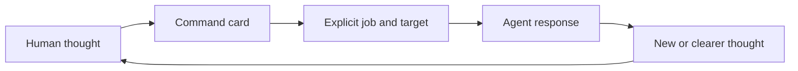

# Think It Through

**Write the thought. Command the next move.**

Develop complex ideas with AI without losing control of the conversation.

Think It Through is a lightweight command palette and starter deck for nonlinear thinking sessions. Each command gives the agent a job and a target, so your message can carry the idea instead of instructions about how to handle it.

## Why commands

Ideas rarely arrive as finished prompts. You branch, revise an assumption, introduce a distant thought, or return to something from twenty messages ago. Ideas can arrive faster than you can package them for an agent.

You end up mixing the substance with repeated steering instructions:

> Clarify these thoughts first. Keep unrelated ideas separate. Show me where they connect. Then respond without jumping to a solution.

You wanted to write the idea. The rest defined the agent's next job.

Think It Through gives recurring jobs short names. You write the thought, add a command, and continue. You no longer need a perfect prompt that combines domain context, reasoning instructions, output format, and conversational direction on every turn.

The commands constrain the agent's next job while your thinking stays open. The agent still generates ideas, finds connections, and surprises you. You choose the kind of help you want next.

## Before and after: distill a messy message

Suppose you are working out how to describe a product:

**Without a named command**

> Maybe this is a command palette, but deck feels more visual. It may also be a human-agent UX layer. Those ideas could converge, though I do not want you to merge them too early. First list each thought clearly, show connections only when they hold, then tell me what you think.

**With a named command**

> Maybe this is a command palette, but deck feels more visual. It may also be a human-agent UX layer. Those ideas could converge.
>
> `/think-distill`

The response follows this contract:

> 🎯 **Latest message** → 🧪 **DISTILL**
>
> **Distilled**
>
> - Command palette describes the human interface.
> - Starter deck gives that palette a visual, extensible form.
> - Human-agent UX describes the broader design problem.
>
> **Connections**
>
> The palette can be the interface, the deck its presentation, and human-agent UX the field it improves.
>
> **Response**
>
> Lead with command palette because readers understand it. Introduce starter deck when you show the cards.

`think-distill` pays the structuring cost without erasing distinctions. Related thoughts remain separate in `Distilled`; supported convergence appears in `Connections`. Unrelated thoughts stay unrelated.

## A command card is a compact contract

Each command is both a human-facing card and a semantic micro-program for the agent:

```text
When → On → Move → Result → Cadence → Boundary
     → Composition → Flow → Display
```

The prose defines intent and limits. A Mermaid flow defines order, branches, loops, and stopping conditions. The display contract names the useful response blocks. Each layer carries different information.



A named command makes the next job explicit. It does not make generated content deterministic. Without a command, the agent responds as usual.

## Start with six cards

### 🧪 Distill

`separate → clarify → connect`

Use `/think-distill` when several fragments need clean wording before the agent responds. It preserves each material thought and exposes only supported relationships. [View the full card](plugins/think-it-through/skills/think-distill/SKILL.md).

### 💬 Discuss

`recover context → explore → keep open`

Use `/think-discuss` when you want an active thinking partner without an interview, challenge, or forced conclusion. [View the full card](plugins/think-it-through/skills/think-discuss/SKILL.md).

### 🔎 Interview

`find gap → ask → integrate → repeat`

Use `/think-interview` when the agent needs to understand your intent, constraints, or preferences. One invocation opens a neutral multi-turn loop with one focused question at a time. [View the full card](plugins/think-it-through/skills/think-interview/SKILL.md).

### 🔥 Grill

`map branches → recommend → question → repeat`

Use `/think-grill` when a proposal, assumption, decision, design, or plan needs pressure. The agent gives a recommended answer with each demanding question and follows the decision tree until the target holds up, fails, or carries explicit risks. [View the full card](plugins/think-it-through/skills/think-grill/SKILL.md).

### 🗺️ Recap

`recover topics → map axes → digest`

Use `/think-recap` when a long conversation has lost its shape. It covers the available conversation by default and organizes the result by meaning rather than chronology. [View the full card](plugins/think-it-through/skills/think-recap/SKILL.md).

### 🧭 Propose

`evaluate → choose → expose tradeoff`

Use `/think-propose` when exploration needs one strong direction. The agent states the proposal, why it fits, what it gives up, and its main risk. You make the decision. [View the full card](plugins/think-it-through/skills/think-propose/SKILL.md).

## Grill Me, with a stable contract

A long prompt such as “question every dependency, research what you can, give your recommendation, ask one question at a time, and continue after each answer” becomes:

> The default conversation map should support domain-specific lenses.
>
> `/think-grill`

The agent starts the loop:

> 🔥 **GRILL** · default map lens
>
> **Recommendation:** Keep one universal lens and let domain skills enrich it.
>
> **Question:** Which real use case fails with `Conversation → Topics → Axes` alone?

After your answer, the same grill continues with the next unresolved branch. You do not repeat the instructions or invoke the command again.

## Build a combo

Start with one card. Add cards when you need more control:

```text
optional ON → one or more MOVES → optional TO + zero or more WITH
```

- `think-on-*` selects the target.
- A move performs one conversational operation.
- `think-with-*` changes the final representation.
- `think-to-*` projects the result into an artifact.

Cards have useful defaults, so `/think-recap` already means the full available conversation. Use a selector when the default is too broad:

```text
/think-on-topic Positioning + /think-recap
```

Chain moves when the second job should consume the first result:

```text
/think-distill + /think-propose
```

Add a representation or artifact:

```text
/think-on-topic Architecture + /think-recap + /think-with-diagrams
/think-on-conversation + /think-to-brief
/think-propose + /think-to-plan + /think-with-reasoning-map
```

A combo binds one selected target to the whole pipeline. The first move consumes that target, later moves consume the previous result, and the selector expires after the combo. `interview` and `grill` retain the target until their loops end. Conflicting selectors or artifact destinations require clarification.

Explicit invocations use one compact signature:

```text
> 🎯 **Latest message** → 🧪 **DISTILL** → 🧭 **PROPOSE** + 📊 **DIAGRAMS**
```

## The full starter deck

| Family | Cards |
| --- | --- |
| Session | [🧩 `think-it-through`](plugins/think-it-through/skills/think-it-through/SKILL.md), [⚡ `think-next`](plugins/think-it-through/skills/think-next/SKILL.md) |
| Moves | [🧪 `think-distill`](plugins/think-it-through/skills/think-distill/SKILL.md), [💬 `think-discuss`](plugins/think-it-through/skills/think-discuss/SKILL.md), [🔎 `think-interview`](plugins/think-it-through/skills/think-interview/SKILL.md), [🔥 `think-grill`](plugins/think-it-through/skills/think-grill/SKILL.md), [🗺️ `think-recap`](plugins/think-it-through/skills/think-recap/SKILL.md), [🧭 `think-propose`](plugins/think-it-through/skills/think-propose/SKILL.md) |
| Target | [🎯 `think-on-conversation`](plugins/think-it-through/skills/think-on-conversation/SKILL.md), [🎯 `think-on-topic`](plugins/think-it-through/skills/think-on-topic/SKILL.md), [🎯 `think-on-axis`](plugins/think-it-through/skills/think-on-axis/SKILL.md) |
| Representation | [📊 `think-with-diagrams`](plugins/think-it-through/skills/think-with-diagrams/SKILL.md), [🧠 `think-with-reasoning-map`](plugins/think-it-through/skills/think-with-reasoning-map/SKILL.md) |
| Artifact | [📄 `think-to-brief`](plugins/think-it-through/skills/think-to-brief/SKILL.md), [📋 `think-to-plan`](plugins/think-it-through/skills/think-to-plan/SKILL.md) |

The deck contains 15 cards. Commands are the human interface, moves are pipeline operations, cards are contracts, and skills package them for Codex and Claude Code.

## Keep the session usable

Think It Through uses one default map lens:

```text
Conversation
└── Topics
    └── Axes
        ├── ideas and assumptions
        ├── proposals and decisions
        ├── tensions and contradictions
        └── open questions
```

The agent can mark axes active, paused, resolved, or superseded. Domain skills can enrich the facets. A product skill might track users and hypotheses; an architecture skill might track interfaces and risks. Both still fit the same conversation map.

Three cards cover different scales:

```text
Distill the message. Recover the session. Preserve what matters.
```

`think-distill` clarifies the latest message. `think-recap` creates a conversational checkpoint. `think-to-brief` creates a portable snapshot for another tool or a later session. A brief can seed future context, but the kit cannot recover removed context or remember another conversation on its own.

## Fit it to your practice

Use the deck inside your existing workflow:

```text
your thought + command card + domain skill + optional template
```

Your method still defines evidence, quality, and the desired outcome. The cards define how the agent should handle the next turn. An architecture skill can supply technical knowledge while `think-grill` tests a decision. A document template can shape the brief produced by `think-to-brief`.

Create a card when you keep rewriting the same response instruction. Merge or remove cards that produce the same job.

```markdown
# <icon> Think <Name>

Context: <available evidence>

**When:** <recurring human moment>
**On:** <default target>
**Move:** <one semantic operation>
**Result:** <recognizable outcome>
**Cadence:** <one-shot or multi-turn>
**Boundary:** <what this card must not do>
**Composition:** <what it consumes and produces>

## Flow
<small normative Mermaid flow>

## Display
<semantic response blocks>
```

## Install

This README uses portable `/think-*` notation. The two agents load the same `SKILL.md` files with different prefixes:

| Portable | Codex | Claude Code |
| --- | --- | --- |
| `/think-recap` | `$think-it-through:think-recap` | `/think-it-through:think-recap` |

### Codex

```bash
codex plugin marketplace add thevzion/think-it-through
codex plugin add think-it-through@think-it-through
```

### Claude Code

```bash
claude plugin marketplace add thevzion/think-it-through --scope user
claude plugin install think-it-through@think-it-through --scope user
```

## Origin and principles

Grill Me supplied the seed: a short name for a response contract worth reusing. Think It Through applies that pattern across complex conversations.

- Human creativity supplies ideas, associations, and judgment.
- Commands remain explicit and cheap enough to use often.
- Each card has one distinct job and a visible contract.
- Individuals and teams can extend the deck without changing its grammar.

## License

MIT
