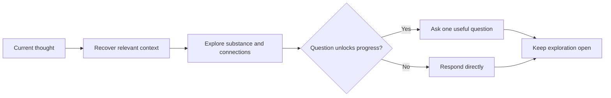

# 💬 Think Discuss

**ID:** `think-it-through/discuss`\
**HACP:** `0.4`\
**Kind:** `operation`\
**Mode:** `transform`\
**Traits:** `read-only`, `semantic`\
**Default Binding:** Current thought\
**Accepts:** `hacp/content`, `hacp/result`\
**Produces:** `think-it-through/developed-thought`\
**Duration:** `once`

**Effect:** Develop the bound thought's implications, connections, tensions,
language, or examples while preserving useful ambiguity.

**Limits:** Ask only when a question unlocks discussion. Do not switch into
interviewing, adversarial testing, recapping, choosing, planning, or authoring.

## Flow

## Format

Begin the combo trace with `> 🎯 **<binding>** → 💬 **DISCUSS**`, then respond naturally without forced section headings.

Add later operation cards or an output with `→` and presentation cards with `+`; show the trace once for the complete combo.
