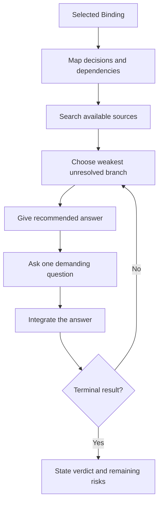

# 🔥 Think Grill

**ID:** `think-it-through/grill`\
**HACP:** `0.4`\
**Kind:** `operation`\
**Mode:** `transform`\
**Traits:** `read-only`, `semantic`, `multi-exchange`\
**Default Binding:** Current proposal, assumption, decision, design, or plan\
**Accepts:** `hacp/content`, `hacp/result`\
**Requires:** `hacp/testable-object`\
**Produces:** `think-it-through/verdict`\
**Duration:** `until-complete`

**Effect:** Walk the bound object's decision tree, resolve discoverable facts,
then test one unresolved branch at a time with a recommendation and demanding
question.

**Limits:** Keep the selected Binding until verdict, stop, or redirection.
Separate fact, inference, and unresolved claim. Do not decide for the human or
ask for information available from sources you can inspect.

## Flow

## Format

At launch, show the full trace: `> 🎯 **<binding>** → 🔥 **GRILL**`. On later turns, show `> 🔥 **GRILL** · <binding>`.

Show `Recommendation`, then `Question`. At completion, show `Verdict` and any remaining risks.
