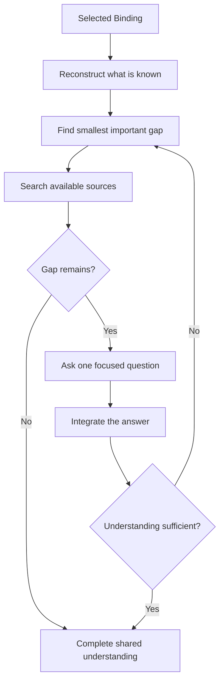

# 🔎 Think Interview

**ID:** `think-it-through/interview`\
**HACP:** `0.4`\
**Kind:** `operation`\
**Mode:** `transform`\
**Traits:** `read-only`, `semantic`, `multi-exchange`\
**Default Binding:** Smallest current subject with important missing information\
**Accepts:** `hacp/content`, `hacp/result`\
**Produces:** `think-it-through/shared-understanding`\
**Duration:** `until-complete`

**Effect:** Resolve discoverable facts, ask one focused question at a time, and
adapt each question to the preceding answer until understanding is sufficient.

**Limits:** Keep the selected Binding until completion, stop, or redirection.
Stay neutral; do not challenge, recommend, or become adversarial testing.

## Flow

## Format

At launch, show the full trace: `> 🎯 **<binding>** → 🔎 **INTERVIEW**`. On later turns, show `> 🔎 **INTERVIEW** · <binding>`.

Show `Question`. Add `Why it matters` only when the reason is unclear. At completion, state the shared understanding without a recommendation.
