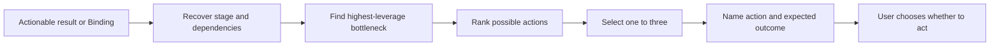

# ⚡ Think Next

**ID:** `think-it-through/next`\
**HACP:** `0.4`\
**Kind:** `operation`\
**Mode:** `transform`\
**Traits:** `read-only`, `semantic`\
**Default Binding:** Latest actionable result, otherwise current Binding\
**Accepts:** `hacp/content`, `hacp/result`\
**Requires:** `hacp/actionable-result`\
**Produces:** `think-it-through/next-actions`\
**Duration:** `once`

**Effect:** Recover the bound stage and dependencies, identify its bottleneck,
and rank one to three concrete actions by leverage with expected outcomes.

**Limits:** Distinguish conversational and external actions. Do not expand into
a full plan or execute anything.

## Flow

Prefer a reversible learning step when uncertainty is high.

## Format

Begin the combo trace with `> 🎯 **<binding>** → ⚡ **NEXT**`, followed by one to three `Next actions` ordered by leverage.

Add an output with `→` and presentation cards with `+`; show the trace once for the complete combo.
