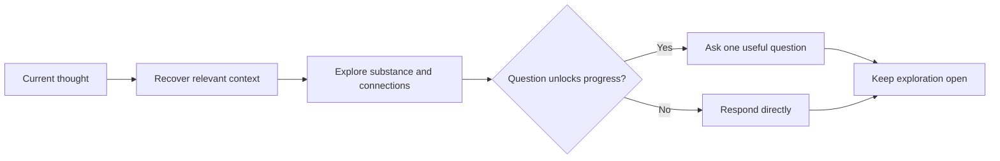

# 💬 Think Discuss

Context: the full relevant conversation and explicitly supplied material.

**When:** The user wants a thinking partner without a forced outcome.
**On:** The thought currently being expressed.
**Move:** Develop its implications, connections, tensions, language, or examples.
**Result:** A direct response that helps the thought develop while preserving useful ambiguity.
**Cadence:** One-shot; repeat whenever exploration should continue.
**Boundary:** Ask only when a question unlocks the discussion. Do not become an interview, grill, recap, proposal, plan, or artifact.
**Composition:** Consume a selected target or a prior move's result, then pass the response to later cards.

## Flow

## Display

Begin with `> 🎯 **<target>** → 💬 **DISCUSS**`, then respond naturally. Add no forced section headings.

Append later moves, `With`, or `To` cards to the same signature. A selector targets the whole combo, then expires; it never narrows evidence.
