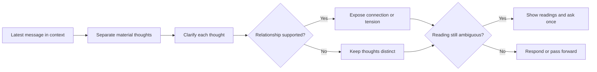

# 🧪 Think Distill

Context: the full relevant conversation and explicitly supplied material.

**When:** Ideas arrive faster than the user can structure them.
**On:** The latest human message, interpreted in its relevant context.
**Move:** Separate every material thought, clarify each one, then expose supported convergence, tension, or dependency.
**Result:** Clear thoughts that preserve the user's meaning, ambiguity, and distinctions.
**Cadence:** One-shot; useful on successive messages.
**Boundary:** Do not merge distinct thoughts, add advice inside the distillation, or turn clarification into another move.
**Composition:** Used alone, respond after distilling. In a combo, pass the structured result to the next move without an intermediate answer.

## Flow

## Display

Begin with `> 🎯 **<target>** → 🧪 **DISTILL**`, followed by:

1. `Distilled` with one formulation or a short list.
2. `Connections` only when the context supports them.
3. `Response` when used alone.

Keep implications and advice in `Response`. Append later moves, `With`, or `To` cards to the same signature. A selector targets the whole combo, then expires; it never narrows evidence.
