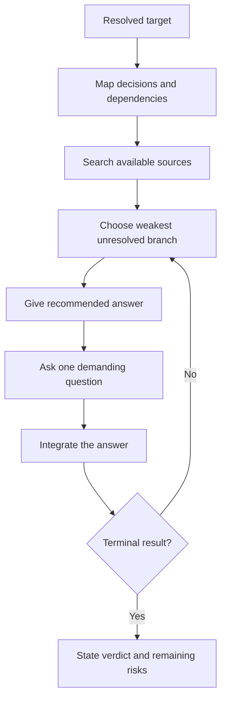

# 🔥 Think Grill

Context: the full relevant conversation and explicitly supplied material.

**When:** A testable idea needs pressure before the user relies on it.
**On (default):** The current proposal, assumption, decision, design, or plan.
**Move:** Walk its decision tree, resolve discoverable facts, then test one unresolved branch at a time with a recommendation and demanding question.
**Result:** A target that is robust, rejected, or reduced to explicit risks.
**Cadence:** Multi-turn. Retain the target until a result or until the user stops, redirects, or invokes another card.
**Boundary:** Separate fact, inference, and unresolved claim. Do not decide for the user.
**Composition:** A selector binds the target for the full loop. A reasoning map can expose the tested logic.

## Flow

## Display

Start with `> 🔥 **GRILL** · <target>`. Repeat this compact badge on every grill turn.

Show `Recommendation`, then `Question`. At completion, show `Verdict` and any remaining risks.
