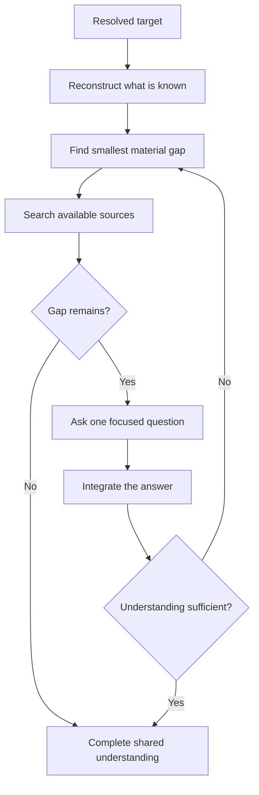

# 🔎 Think Interview

Context: the full relevant conversation and explicitly supplied material.

**When:** A material gap prevents shared understanding.
**On:** The smallest current subject that contains that gap.
**Move:** Resolve discoverable facts, then ask one focused question at a time and adapt to each answer.
**Result:** Enough shared understanding to continue without guessing.
**Cadence:** Multi-turn. Retain the target until understanding is sufficient or the user stops, redirects, or invokes another card.
**Boundary:** Stay neutral. Do not challenge, recommend, or turn the interview into a grill.
**Composition:** A selector binds the target for the full loop. A modifier can represent the evolving understanding.

## Flow

## Display

Start with `> 🔎 **INTERVIEW** · <target>`. Repeat this compact badge on every interview turn.

Show `Question`. Add `Why it matters` only when the reason is unclear. At completion, state the shared understanding. Do not include a recommendation.
