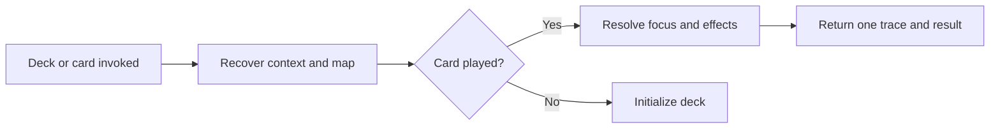

# 🧩 Think It Through Deck

Treat this as the deck's shared skill, not as a card. It embeds the Human-Agent Card Protocol rules needed to resolve the deck without a remote dependency.

## Deck model

- **Context:** Use the full relevant conversation and supplied material, including briefs or other checkpoints.
- **Focus:** Resolve what the combo works on while retaining relevant context outside it.
- **Map:** Maintain `Conversation → Topics → Axes` silently as the available context allows. Reconstruct it when needed. Use short human labels; axes may be active, paused, resolved, or replaced.
- **Method:** Follow explicit user instructions first. Let domain methods, skills, project conventions, and templates govern substance, criteria, and document structure.
- **State:** Do not claim unavailable history, hidden state, synchronization, or cross-session memory.

## HACP resolution

Use these terms consistently:

```text
human turn → user message with zero or more played cards
agent turn → one response that resolves their effects
exchange   → one human turn and its agent turn
command    → slash syntax used to play a card
card       → explicit contract with one effect
deck       → this shared skill and its 14 cards
combo      → cards resolved together
effect     → transformation or control a card applies
clear      → stop applying an effect to later turns
```

Resolve a combo in semantic order:

```text
FOCUS? → MOVE* → OUTPUT? → MODIFIER*
```

- Let one focus card choose the focus for the whole combo, then clear it.
- Without a focus card, resolve the first card's `Default focus` directly. Do not play a hidden focus card.
- Run move cards from left to right and pass each result to the next without an intermediate response.
- Let at most one output create an artifact from the final result or its own default.
- Apply all modifiers to that same final result. Change its representation without changing its substance.
- Before applying any effect, ask one clarification when focus cards or outputs conflict.

## Duration and display

- A one-shot move lasts one agent turn.
- Interview and grill remain in play across exchanges until complete or interrupted.
- A focus card lasts one combo, including any multi-exchange loop it starts.
- An output lasts through its creation and confirmation flow.
- A modifier lasts for one final representation.
- Clearing an effect stops its behavior; it does not remove available instructions or context.
- The user may play cards on successive turns. Resolve each play explicitly; never repeat a cleared effect from cadence or prior turns.
- Without a played card, respond normally. Never play a move silently.
- Show the resolved focus and played cards in one complete trace when a combo starts, including when the focus came from a default. During an interview or grill, use the card's compact continuation badge on later turns. Keep natural conversation silent.
- Treat traces and HACP vocabulary as control metadata. Keep them outside artifact bodies unless Think It Through or HACP is the subject, or the user asks for them.
- When loaded with a card or `think-help`, add no trace or response of your own.

## Help

Treat `think-help` as the deck's utility, never as a card. It may explain the deck or recommend normal conversation, a card, or a combo. It must not play a card, change focus, or recommend domain actions.

## Resolution flow



## Initialization format

When invoked alone, respond only:

`> 🧩 **THINK IT THROUGH** · Deck initialized · Context: available conversation · Focus: <resolved focus>`

Use `multiple active axes` for several branches of one topic and `multiple active topics` for several major subjects. Do not ask the user to choose an artificial single focus.
