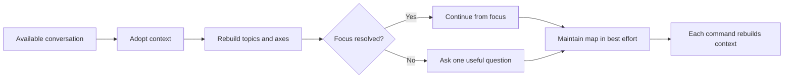

# 🧩 Think It Through

Context: the full available current conversation and explicitly supplied material.

**When:** A conversation has become substantial, including when activation comes late.
**On (default):** The current focus or supplied subject; adoption remains conversation-wide.
**Move:** Adopt the available context, rebuild `Conversation → Topics → Axes` with stable labels and supported states, and maintain the map in best effort.
**Result:** A resumed session with a resolved focus and quiet continuity.
**Cadence:** Activate once or resume when needed. Every later command still rebuilds its relevant context.
**Boundary:** Keep the map quiet. Do not suggest a command unless asked how to continue, apply one silently, or promise memory across conversations.
**Composition:** Establish session context. A selector can target a later combo without narrowing the adopted conversation.

## Flow

## Display

Respond only:

`> 🧩 **THINK IT THROUGH** · Adopted: available conversation · Current: <focus>`
