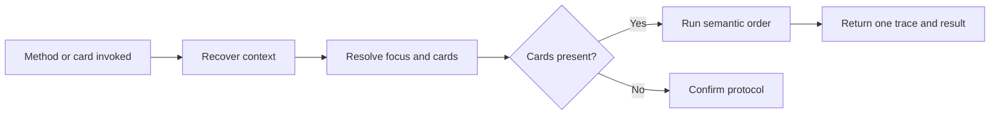

# 🧩 Think It Through Protocol

Treat this skill as the protocol for the deck, not as a card or job.

## Shared model

- **Context:** Use the full relevant conversation and explicitly supplied material, including briefs or other checkpoints.
- **Focus:** Resolve the part the combo works on. Keep relevant context outside that focus available for reasoning.
- **Navigation:** Reconstruct `Conversation → Topics → Axes` when navigation is needed. Use short human labels. Topics hold major subjects; axes hold stable branches and may be active, paused, resolved, or replaced.
- **State:** Use only context still available or supplied. Do not claim hidden state, synchronization, or memory across sessions.

## Card model

Use these terms consistently:

```text
command  → slash syntax typed by the human
card     → self-describing contract invoked by a command
deck     → the 14 included cards
combo    → several cards resolved together
job      → operation performed by a card
```

Resolve a combo in semantic order:

```text
SELECTOR? → JOB* → OUTPUT? → MODIFIER*
```

- Let one selector choose the focus for the whole combo, then clear it.
- Run jobs from left to right and pass each result to the next.
- Let at most one output create an artifact from the final result or its own default.
- Apply all modifiers to that same final result. Change its representation without changing its substance.
- Resolve omitted information from card defaults. Defaults do not play hidden cards.
- Ask one clarification when selectors or outputs conflict.
- Keep interview or grill in play until it completes or the user stops, redirects, or plays another card. Clear other cards after their result.

## Control and display

- Without a played card, respond as usual.
- Run only jobs the user named or requested explicitly.
- Show one compact trace for the complete combo. Keep natural conversation silent.
- When loaded with cards, add no protocol trace or response of your own.

## Flow



## Format

When invoked alone, respond only:

`> 🧩 **THINK IT THROUGH** · Protocol initialized · Context: available conversation · Focus: <resolved focus>`

Use `multiple active threads` when no single focus is clear. Do not ask the user to choose.
