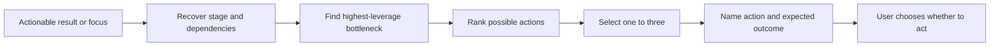

# ⚡ Think Next

Context: the full relevant conversation and explicitly supplied material.

**When:** The user knows enough to move but needs the highest-leverage next step.
**On (default):** The latest actionable result, otherwise the current focus.
**Move:** Recover the current stage and dependencies, identify the bottleneck, then rank concrete actions by leverage.
**Result:** One to three actions with expected outcomes.
**Cadence:** One-shot.
**Boundary:** Distinguish conversational and external actions. Do not expand into a full plan or execute anything.
**Composition:** Consume the latest result or a selected target. A projection can turn the chosen direction into a plan.

## Flow

Prefer a reversible learning step when uncertainty is high.

## Display

Begin with `> 🎯 **<target>** → ⚡ **NEXT**`, followed by one to three `Next actions` ordered by leverage.

Append later `With` or `To` cards to the signature. A selector targets the whole combo, then expires; it never narrows evidence.
