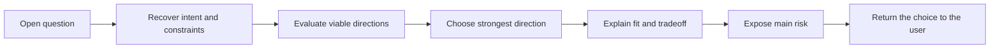

# 🧭 Think Propose

Context: the full relevant conversation and explicitly supplied material.

**When:** Exploration has produced an open question that needs direction.
**On (default):** The current open question or decision.
**Move:** Evaluate the viable directions, choose one, and expose why it fits, what it gives up, and where it can fail.
**Result:** One strong proposal that the user can accept, reject, or refine.
**Cadence:** One-shot.
**Boundary:** Do not hide the decisive tradeoff, offer a soft menu, make the final decision, or continue into planning.
**Composition:** Consume a target or prior move's result. Pass the proposal to a modifier, brief, or plan.

## Flow

If the user requests a lateral direction, choose one that changes the structure rather than the wording.

## Display

Begin with `> 🎯 **<target>** → 🧭 **PROPOSE**`, followed by `Direction`, `Why`, `Tradeoff`, `Main risk`, and `Your call`.

Append later `With` or `To` cards to the signature. A selector targets the whole combo, then expires; it never narrows evidence.
