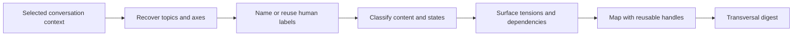

# 🗺️ Think Recap

Context: the full relevant conversation and explicitly supplied material.

**When:** The discussion has lost its overall shape or needs a checkpoint.
**On (default):** The full available conversation.
**Move:** Reconstruct topics and axes with concise human-readable labels, reuse a supported label when it still fits, classify contents and states, then synthesize relationships across them.
**Result:** A navigable conceptual map whose topic and axis labels can be reused by selectors, followed by a coherent digest of where the thinking stands.
**Cadence:** One-shot; repeat at useful checkpoints.
**Boundary:** Preserve uncertainty and disagreement. Do not suggest a next command, introduce a direction, decide, plan, create technical identifiers, persist state, or create a file.
**Composition:** A selector can narrow the target. A modifier changes representation. `think-to-brief` materializes this explicit checkpoint.

## Flow

## Display

Begin with `> 🎯 **<target>** → 🗺️ **RECAP**`, followed by `Map` and `Digest`. In `Map`, give each topic and axis a concise label the user can repeat with `think-on-topic` or `think-on-axis`.

Append `+ 📊 **DIAGRAMS**`, `+ 🧠 **REASONING MAP**`, or `→ 📄 **BRIEF**` when composed. Do not append suggested moves. A selector targets the whole combo, then expires; it never narrows evidence.
