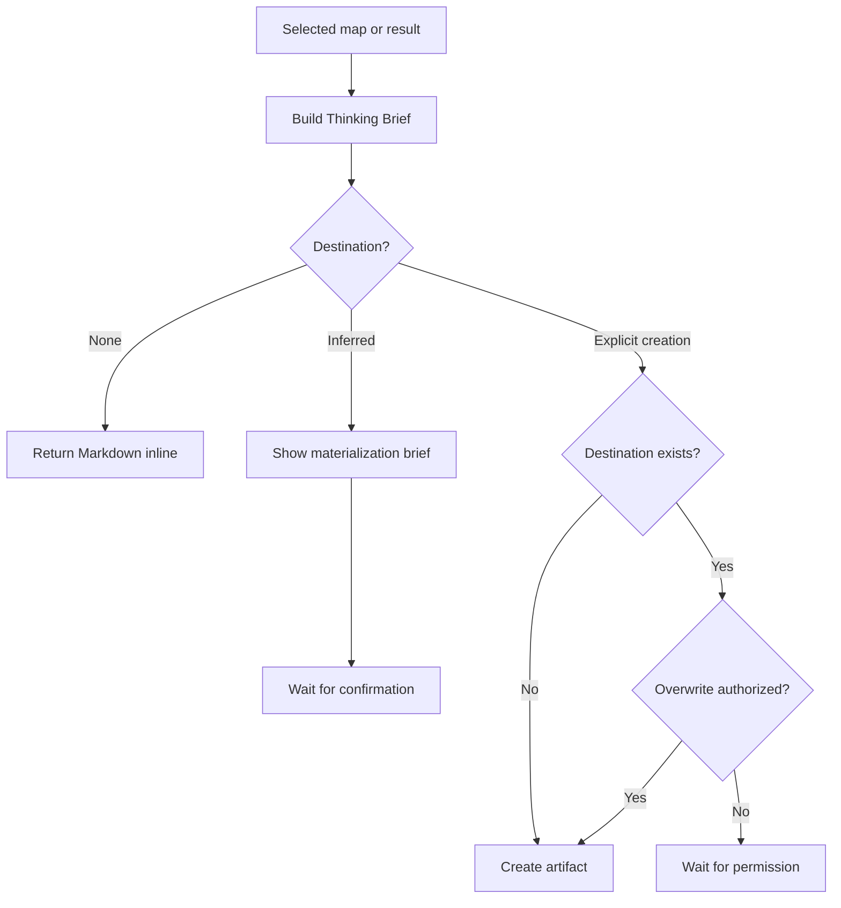

# 📄 Think To Brief

Context: the full relevant conversation and explicitly supplied material.

**When:** The user wants to preserve thinking for reuse in this session, another session, or another tool.
**On:** The full available conversation, unless a combo supplies a selected result.
**Move:** Read the selected map or result directly, infer a useful document form and audience, then project it into a neutral Thinking Brief.
**Result:** Portable Markdown organized by topics and axes, with purpose, synthesis, decisions, tensions, open questions, and a resumption point.
**Cadence:** Occasional artifact projection.
**Boundary:** Do not run an implicit recap, invent missing conclusions, update the snapshot later, or overwrite a destination without permission.
**Composition:** Materialize a co-invoked recap or move result. A modifier can make the artifact diagram-led or expose its reasoning.

## Flow

Prefer an existing project convention, otherwise portable Markdown. An inferred destination requires an overview, outline, inclusions, exclusions, and proposed path before confirmation.

## Display

Begin with `> 🎯 **<target>** → 📄 **BRIEF**`. Append `+ 📊 **DIAGRAMS**` or `+ 🧠 **REASONING MAP**` when composed.

Show status only while awaiting confirmation or overwrite permission. A selector targets the whole combo, then expires; it never narrows evidence.
