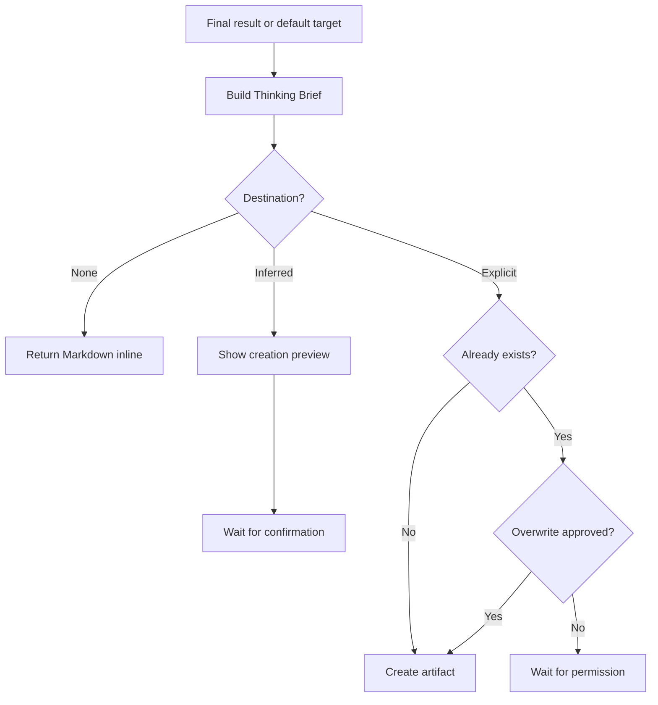

# 📄 Think To Brief

**Context:** The full relevant conversation and explicitly supplied material.
**Use when:** The user wants to preserve thinking for reuse in this session, another session, or another tool.
**Default target:** The full available conversation, unless a combo supplies a selected result.
**Job:** Read the selected map or result directly, infer a useful document form and audience, then produce a neutral Thinking Brief.
**Result:** A portable Markdown checkpoint organized by topics and axes, with purpose, synthesis, decisions, tensions, open questions, and where to resume.
**Runs for:** One output, with confirmation only when a destination must be inferred or an existing artifact could be overwritten.
**Limits:** Do not run an implicit recap, invent conclusions, synchronize the checkpoint later, claim cross-session memory, or overwrite a destination without permission.
**Combines with:** Consume the final job result or its default target. Modifiers apply to the resulting brief. Ask one clarification if another output appears in the combo.

## Flow

Prefer an existing project convention, otherwise portable Markdown. A creation preview states the overview, outline, inclusions, exclusions, and proposed path.

## Format

Add `→ 📄 **BRIEF**` after the final job in the combo trace, or begin with `> 🎯 **<target>** → 📄 **BRIEF**` when used alone. Add modifiers with `+`.

Show status only while awaiting confirmation or overwrite permission. A later session resumes only when the user supplies the brief or its content.
