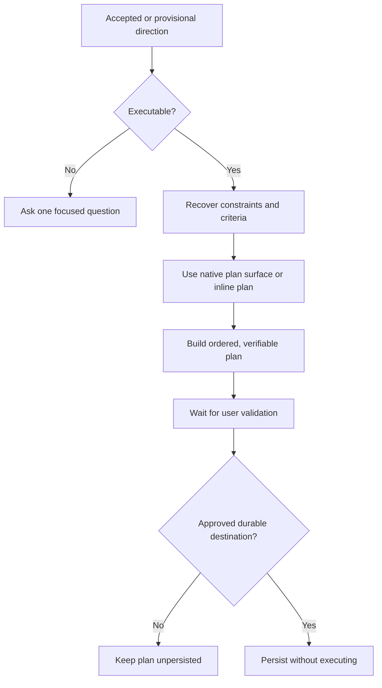

# 📋 Think To Plan

Context: the full relevant conversation and explicitly supplied material.

**When:** An accepted or explicitly provisional direction needs operational structure.
**On:** That executable direction.
**Move:** Recover constraints and success criteria, then create an ordered, verifiable Execution Plan on the agent's native planning surface when available.
**Result:** A proposed plan with objective, ordered work, dependencies, risks, verification, and completion criteria.
**Cadence:** Occasional artifact projection followed by user validation.
**Boundary:** Ask once when no executable direction exists. Do not fabricate details, treat the plan as approval, execute it, persist it without an approved destination, or overwrite without permission.
**Composition:** Consume a proposal or selected direction. A modifier can add diagrams or a reasoning map.

## Flow

State whether the source direction is accepted or provisional.

## Display

Begin with `> 🎯 **<target>** → 📋 **PLAN**`. Append `+ 📊 **DIAGRAMS**` or `+ 🧠 **REASONING MAP**` when composed.

Show status while awaiting direction, validation, destination, or overwrite permission. A selector targets the whole combo, then expires; it never removes material dependencies.
