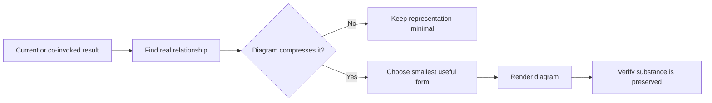

# 📊 Think With Diagrams

Context: the full relevant conversation and explicitly supplied material.

**When:** Relationships would be easier to understand as a visual structure.
**On:** The co-invoked result, otherwise the latest substantive result or focus.
**Move:** Identify the relationship worth compressing, choose the smallest useful form, and add it without changing the substance.
**Result:** A flow, tree, timeline, matrix, table, or Mermaid diagram tied to the content.
**Cadence:** One-shot; create no modifier state.
**Boundary:** Do not decorate, duplicate prose, remove qualifications, or introduce a conclusion. Say briefly when a diagram would not help.
**Composition:** Modify the final result of a move, combo, brief, or plan.

## Flow

## Display

Append `+ 📊 **DIAGRAMS**` to a combo signature. Standalone, begin with `> 🎯 **<target>** → 📊 **DIAGRAMS**`.

Place each diagram beside the content it clarifies. A selector targets the whole combo, then expires; it never narrows evidence.
