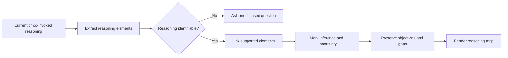

# 🧠 Think With Reasoning Map

Context: the full relevant conversation and explicitly supplied material.

**When:** The user needs to inspect how a claim, proposal, decision, or system holds together.
**On (default):** The co-invoked reasoning, otherwise the current proposal or decision.
**Move:** Extract stated claims, evidence, premises, assumptions, inferences, implications, and objections, then map supported links.
**Result:** An argument map for a claim or a broader reasoning map for a decision or system.
**Cadence:** One-shot; create no modifier state.
**Boundary:** Mark inferred links and uncertainty. Do not invent evidence, causality, confidence, repair gaps, challenge, or decide.
**Composition:** Modify the final result of a move, combo, brief, or plan.

## Flow

## Display

Append `+ 🧠 **REASONING MAP**` to a combo signature. Standalone, begin with `> 🎯 **<target>** → 🧠 **REASONING MAP**`.

Use labels that distinguish claims, evidence, assumptions, inferences, and objections. A selector targets the whole combo, then expires; it never narrows evidence.
