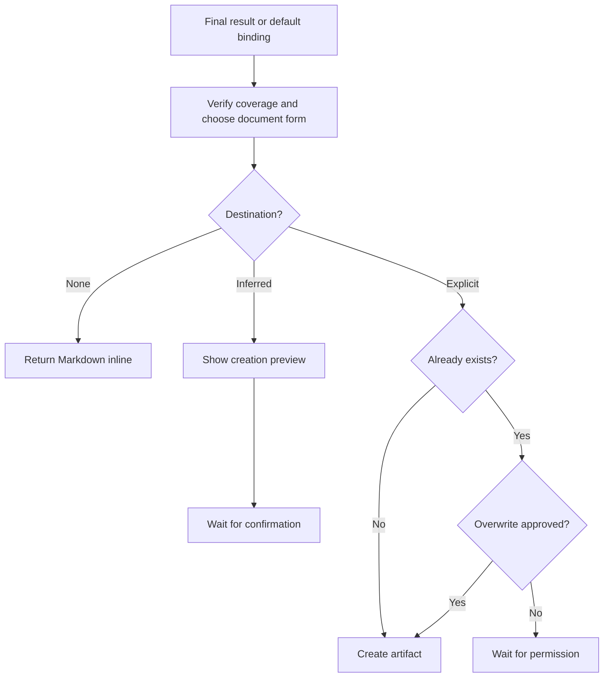

# 📄 Think To Brief

**ID:** `think-it-through/to-brief`\
**HACP:** `0.4`\
**Kind:** `operation`\
**Mode:** `artifact`\
**Traits:** `read-only`, `artifact`\
**Default Binding:** Result supplied by the combo, otherwise full available
conversation\
**Accepts:** `hacp/content`, `hacp/result`\
**Produces:** `think-it-through/thinking-brief`\
**Duration:** `until-confirmed`

**Effect:** Verify coverage, infer a useful document form and audience, and
produce a portable Markdown checkpoint using the subject's vocabulary.

**Limits:** Keep traces and deck vocabulary outside the artifact unless they
are the subject or requested. Do not run a hidden recap, invent conclusions,
claim cross-session memory, synchronize later, or overwrite without permission.

## Flow

Follow an applicable method or project convention; otherwise use portable Markdown. A creation preview states the overview, outline, inclusions, exclusions, and proposed path.

## Format

Add `→ 📄 **BRIEF**` after the final move in the combo trace, or begin with `> 🎯 **<binding>** → 📄 **BRIEF**` when used alone. Add presentation cards with `+`.

Keep that trace in the conversational envelope, outside the brief. Show status only while awaiting confirmation or overwrite permission. A later session resumes only when the user supplies the brief or its content.
