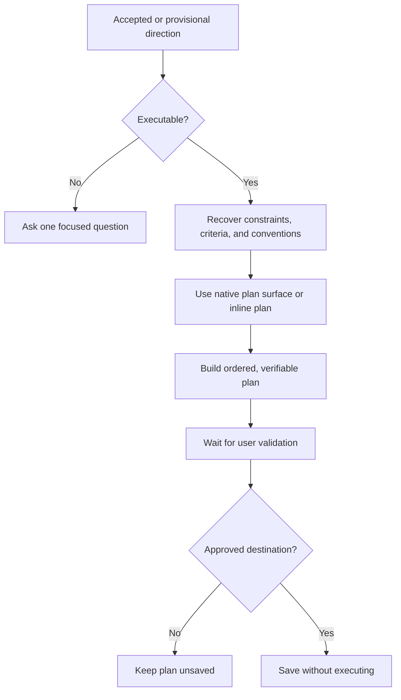

# 📋 Think To Plan

**ID:** `think-it-through/to-plan`\
**HACP:** `0.4`\
**Kind:** `operation`\
**Mode:** `artifact`\
**Traits:** `read-only`, `artifact`\
**Default Binding:** Current executable direction\
**Accepts:** `hacp/content`, `hacp/result`\
**Requires:** `hacp/executable-direction`, `hacp/user-accepted-or-provisional`\
**Produces:** `think-it-through/execution-plan`\
**Duration:** `until-confirmed`

**Effect:** Recover constraints, success criteria, and applicable conventions,
then produce an ordered, verifiable Execution Plan on the native planning
surface when available.

**Limits:** Keep traces and deck vocabulary outside the plan unless they are
the subject or requested. Ask once when no executable direction exists. Do not
fabricate details, treat the plan as approval, execute, save without an
approved destination, or overwrite without permission.

## Flow

State whether the source direction is accepted or provisional.

## Format

Add `→ 📋 **PLAN**` after the final move in the combo trace, or begin with `> 🎯 **<binding>** → 📋 **PLAN**` when used alone. Add presentation cards with `+`.

Before any plan content, emit the one complete combo trace. Keep it in the
conversational envelope, outside the plan, including when a native planning
surface is available. Show status while awaiting direction, validation,
destination, or overwrite permission. A plan never authorizes execution.
