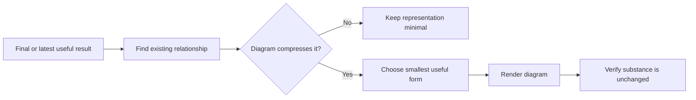

# 📊 Think With Diagrams

**ID:** `think-it-through/with-diagrams`\
**HACP:** `0.4`\
**Kind:** `presentation`\
**Mode:** `render`\
**Traits:** `read-only`, `semantic`\
**Default Binding:** Current Working Object, then latest substantive result or
Binding\
**Accepts:** `hacp/result`\
**Produces:** `hacp/presentation`\
**Duration:** `once`

**Effect:** Identify the relationship worth compressing, choose the smallest
useful form, and render it without advancing or changing the semantic object.

**Limits:** Do not decorate, duplicate prose, remove qualifications, or add
conclusions, decisions, or certainty. Say briefly when a diagram would not help.

## Flow

## Format

Append `+ 📊 **DIAGRAMS**` to the complete combo trace. Used alone, begin with `> 🎯 **<binding>** + 📊 **DIAGRAMS**`.

Place each diagram beside the content it clarifies.
