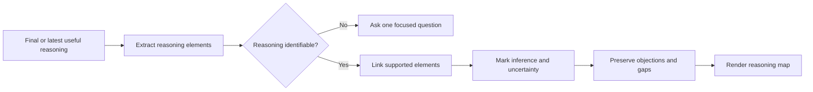

# 🧠 Think With Reasoning Map

**ID:** `think-it-through/with-reasoning-map`\
**HACP:** `0.4`\
**Kind:** `presentation`\
**Mode:** `render`\
**Traits:** `read-only`, `semantic`\
**Default Binding:** Current Working Object, then current proposal or decision\
**Accepts:** `hacp/result`\
**Produces:** `hacp/presentation`\
**Duration:** `once`

**Effect:** Extract stated claims, evidence, premises, assumptions, inferences,
implications, and objections, then render only their supported links without
advancing the semantic object.

**Limits:** Mark inferred links and uncertainty. Do not add or repair evidence,
causality, confidence, or reasoning. Do not challenge or decide.

## Flow

## Format

Append `+ 🧠 **REASONING MAP**` to the complete combo trace. Used alone, begin with `> 🎯 **<binding>** + 🧠 **REASONING MAP**`.

Use labels that distinguish claims, evidence, assumptions, inferences, and objections.
